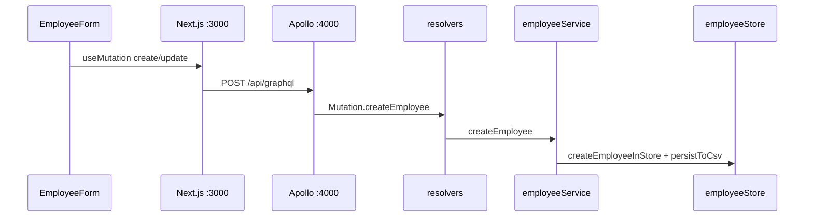
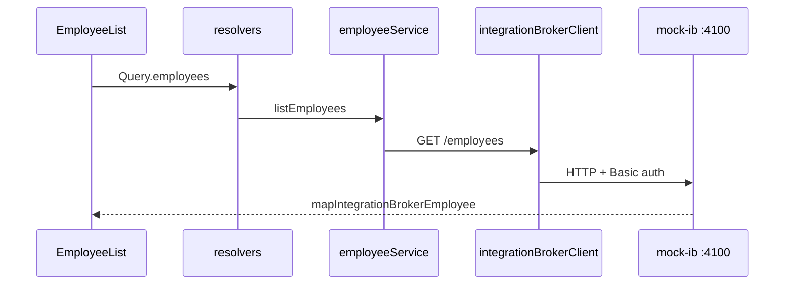
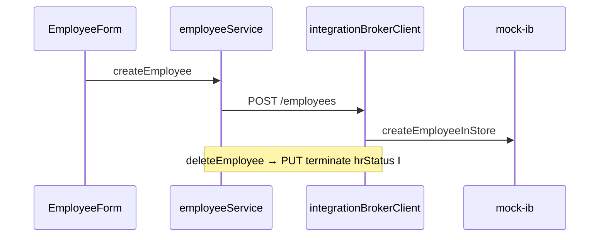
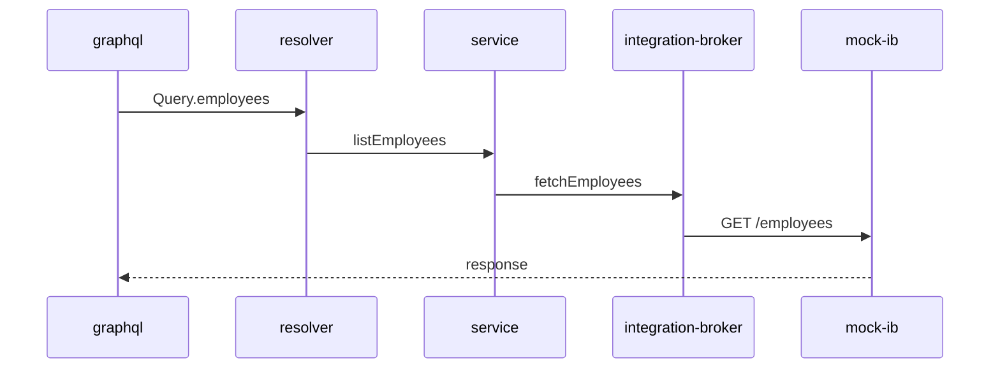
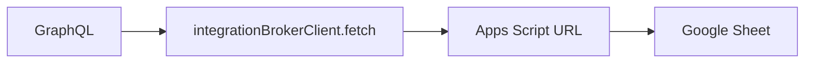

# Code path: GraphQL → PeopleSoft (mock)

Trace every layer when you click **Save** or load the employee list.

**Org context (app team vs PeopleSoft team):** [TEAM_BOUNDARIES.md](./TEAM_BOUNDARIES.md)

**Scripts by mode:** [SCRIPT_COURSE_LINKS](./SCRIPT_COURSE_LINKS.md#by-course-module-course--script) · Mode B: [`npm run dev:mock-ps`](../package.json) → [`mock-ib-server.ts`](../backend/src/mock-ib-server.ts) · Mode A CSV: [`npm run export:employees`](../package.json) → [`export-employees-csv.ts`](../backend/scripts/export-employees-csv.ts)

## Two modes in this project

| Mode | `PEOPLESOFT_DATA_SOURCE` | Where data lives | See HTTP calls? |
|------|------------------------|------------------|-----------------|
| **A. Direct mock** | `mock` | `employeeStore.ts` → `employees.csv` | No HTTP |
| **B. Integration Broker** | `integration-broker` | HTTP → mock PS on :4100 (or real PS / Google Apps Script) | **Yes** |

To **see the call in code**, use mode **B**.

---

<a id="mode-a--graphql--csv-current-default"></a>

## Mode A — GraphQL → CSV (current default)

**Course:** [Module 6](./COURSE.md#module-6--peoplesoft-data-layer-mock--csv) · **Run:** [`npm run dev`](../package.json) · **Data scripts:** [`export-employees-csv.ts`](../backend/scripts/export-employees-csv.ts), [`sync-employees-from-sheet.ts`](../backend/scripts/sync-employees-from-sheet.ts)



**Files to open:**

1. `frontend/components/EmployeeForm.tsx` — `useMutation`, `handleSubmit`
2. `backend/src/resolvers/index.ts` — `Mutation.createEmployee`
3. `backend/src/services/employeeService.ts` — `createEmployee`
4. `backend/src/peoplesoft/employeeStore.ts` — `createEmployeeInStore`, `persistToCsv`

Google Sheet is **not** in this path. Update Sheet manually: **File → Import** `employees.csv`.

---

<a id="mode-b--graphql--http--mock-ps-see-fetch"></a>

## Mode B — GraphQL → HTTP → Mock PS (see `fetch`)

**Course:** [Module 7](./COURSE.md#module-7--mock-integration-broker) · **Run:** [`npm run dev:mock-ps`](../package.json) · **Mock server:** [`mock-ib-server.ts`](../backend/src/mock-ib-server.ts)

### Read (employee list)



### Write (add / edit / delete)

> **PeopleSoft reality:** PS does **not** hard-delete job rows. A “delete” is a **new effective-dated row** with **`EFFDT`** + **`HR_STATUS`** (e.g. `I` = inactive). History stays for audit and as-of queries. **This app matches that:** `deleteEmployee` calls `terminateEmployeeInStore()` (appends a row with `hr_status=I`) or IB **PUT** with `effdt` + `hrStatus` — see [§ PS terminate vs delete](#ps-terminate-vs-delete).



**Open `integrationBrokerClient.ts`** — every `fetch()` is the “call to PeopleSoft” (mock or real). JSDoc on `deleteEmployee`, `createEmployee`, etc. explains **why** (terminate vs DELETE).  
Outbound bodies are not PS-shaped yet — see [Two-way mapping](#two-way-mapping).

---

## Run mode B locally (mock IB on :4100)

**Terminal 1 — repo root:**

```bash
cd ~/Documents/Projects/peoplesoft-graphql-starter
cp backend/.env.mock-ib.example backend/.env
npm run dev:mock-ps   # mock-ib-server.ts + server.ts + frontend — Module 7
```

**`backend/.env`:**

```env
PEOPLESOFT_DATA_SOURCE=integration-broker
PS_BASE_URL=http://localhost:4100
PS_USERNAME=demo
PS_PASSWORD=demo
```

Watch terminals when you use the UI (`npm run dev:mock-ps` labels them **`[backend]`** and **`[mock-ps]`**).

**Dev trace (follow every function on the path):** Filter logs with **`[trace]`**. Each function logs **`layer · functionName()`** on entry and optional **`functionName() ←`** on return. Enabled by default in dev (`NODE_ENV` ≠ `production`). Set `DEV_TRACE=0` in `backend/.env` to disable.

| Layer | File(s) |
|-------|---------|
| `graphql` | `graphql/devTracePlugin.ts` |
| `resolver` | `resolvers/index.ts` |
| `service` | `services/employeeService.ts` |
| `integration-broker` | `peoplesoft/integrationBrokerClient.ts` |
| `mock-ib` | `peoplesoft/mockIntegrationBroker/server.ts` |
| `payloads` | `peoplesoft/mockIntegrationBroker/payloads.ts` |
| `store` | `peoplesoft/employeeStore.ts` |
| `effdate` | `peoplesoft/effectiveDating.ts` |
| `mapper` | `peoplesoft/mappers.ts` |
| `jobHistory` | `peoplesoft/jobHistory.ts` |



**Console + files:** `npm run dev:mock-ps` tees **`[mock-ps]`**, **`[backend]`**, **`[frontend]`** to `logs/*.log` and the terminal. Tail with `npm run logs` or `npm run logs:follow`. Plain stack (no log files): `npm run dev:mock-ps:plain`.

---

<a id="mode-c--graphql--google-sheet-as-mock-ps-apps-script"></a>

## Mode C — GraphQL → Google Sheet as mock PS (Apps Script)

**Course:** [GOOGLE_SHEET_AS_MOCK_PS](./GOOGLE_SHEET_AS_MOCK_PS.md) · **Run:** [`npm run dev`](../package.json) · **Deploy:** [`google-apps-script-mock-ps.gs`](./google-apps-script-mock-ps.gs)

Your sheet can **be** the mock PeopleSoft server:

1. Deploy script: [google-apps-script-mock-ps.gs](./google-apps-script-mock-ps.gs) (see [GOOGLE_SHEET_AS_MOCK_PS.md](./GOOGLE_SHEET_AS_MOCK_PS.md))
2. Set `PS_BASE_URL` to the Apps Script web app URL
3. Same `integrationBrokerClient.ts` `fetch()` calls — but data reads/writes **your Sheet**



---

## Real PeopleSoft (production)

**Course:** [Module 11](./COURSE.md#module-11--real-peoplesoft--row-security) · [PEOPLESOFT_IB_ROW_SECURITY](./PEOPLESOFT_IB_ROW_SECURITY.md)

Same client file, different URL:

```env
PS_BASE_URL=https://your-peoplesoft-host/.../your-rest-base
```

Only change: `integrationBrokerClient.ts` paths + `mappers.ts` field names.  
GraphQL and frontend stay the same.

---

<a id="two-way-mapping"></a>

## Two-way mapping (GraphQL ↔ PeopleSoft IB)

**Team boundary:** Your BFF owns `mappers.ts` and `integrationBrokerClient.ts`. The PeopleSoft team owns the Integration Broker REST contract (field names, verbs, eff-dated writes). Agree the contract before implementing outbound mapping.

### Current state (inbound only)

| Direction | Status | Where |
|-----------|--------|--------|
| **Inbound** (PS JSON → app) | Implemented | `mapIntegrationBrokerEmployee()` in [`mappers.ts`](../backend/src/peoplesoft/mappers.ts) |
| **GraphQL ↔ internal** | 1:1 — no separate GraphQL mapper | [`schema.ts`](../backend/src/graphql/schema.ts) fields match `EmployeeRecord`; resolvers pass records through |
| **Outbound** (app → PS JSON) | **Not mapped** | `createEmployee` / `updateEmployee` in [`integrationBrokerClient.ts`](../backend/src/peoplesoft/integrationBrokerClient.ts) send `JSON.stringify(input)` with **camelCase** keys (`emplid`, `name`, `email`, …) |

Mock IB **GET** responses use PeopleSoft-shaped rows from [`mockIntegrationBroker/payloads.ts`](../backend/src/peoplesoft/mockIntegrationBroker/payloads.ts) (`jobRowToPsBrokerRow` → `EMPLID`, `NAME`, `EMAIL_ADDR`, …). Reads therefore exercise the inbound mapper; writes today do **not** mirror that shape on the wire.

### Field table (Integration Broker JSON ↔ internal)

Inbound `mapIntegrationBrokerEmployee()` accepts PS-style names first, then camelCase fallbacks (useful for mocks and transitional APIs).

| PeopleSoft / IB (inbound) | Internal (`EmployeeRecord`) | Outbound today |
|---------------------------|----------------------------|----------------|
| `EMPLID` | `emplid` | `emplid` (camelCase) |
| `NAME` | `name` | `name` |
| `EMAIL` / `EMAIL_ADDR` | `email` | `email` |
| `DEPTID` | `department` | `department` |
| `POSITION` | `position` | `position` |
| `SALARY` | `salary` | `salary` |
| `MANAGER_ID` | `managerEmplid` | `managerEmplid` |
| `HR_STATUS` | `hrStatus` on `JobRow` (CSV `hr_status`) | terminate: `hrStatus` / `HR_STATUS` = `I` on PUT |

Mock list/detail rows expose `EFFDT` and `HR_STATUS` (see `PsBrokerEmployeeRow` in `payloads.ts`). `EFFDT` is not on `EmployeeRecord`; eff-dated writes use `effdt` on `IntegrationBrokerWriteInput` when the PS contract supports it.

<a id="ps-terminate-vs-delete"></a>

### PeopleSoft “delete” = effective-dated terminate (not row delete)

| Layer | What this repo does today | Production PeopleSoft |
|-------|---------------------------|------------------------|
| **GraphQL** | `deleteEmployee(emplid)` → `Boolean` | Same mutation name; BFF maps to terminate |
| **Mock CSV** | `terminateEmployeeInStore()` — new row, `hr_status=I`, same `emplid` | Eff-dated terminate row; history in CSV |
| **BFF / IB client** | `deleteEmployee` → **PUT** `{ effdt, hrStatus: "I" }` (or mock **DELETE** alias) | IB contract may use PUT/POST + `EFFDT` + `HR_STATUS` |
| **List / get** | `pickActiveEffectiveRow()` hides inactive effective rows | Active employees only in default UI |

**Outbound mapping (future):** `mapEmployeeToIntegrationBroker()` for delete should emit `EFFDT` + `HR_STATUS` (and any fields your IB team requires).

**Code:** [`employeeStore.ts`](../backend/src/peoplesoft/employeeStore.ts) (`terminateEmployeeInStore`), [`effectiveDating.ts`](../backend/src/peoplesoft/effectiveDating.ts) (`pickActiveEffectiveRow`), [`integrationBrokerClient.ts`](../backend/src/peoplesoft/integrationBrokerClient.ts) (`deleteEmployee` → PUT).

### Why two-way mapping matters

GraphQL mutations (`createEmployee`, `updateEmployee`) ultimately call IB **POST** / **PUT**. If production IB expects PeopleSoft field names (`EMPLID`, `NAME`, `EMAIL_ADDR`, …), sending camelCase bodies will fail validation or silently ignore fields. A symmetric **outbound** mapper keeps Side 1 stable while Side 2’s JSON contract stays explicit.

### Steps to implement two-way mapping (future work — docs only)

1. **Agree REST contract with the PS/IB team** — sample POST/PUT JSON, required fields, eff-dated create/update/**terminate** rules (not hard delete), error shapes. Update [`DOCKER_AND_IB_CONFIGURE.md`](./DOCKER_AND_IB_CONFIGURE.md) checklist when samples arrive.
2. **Add `mapEmployeeToIntegrationBroker()`** in [`mappers.ts`](../backend/src/peoplesoft/mappers.ts) — inverse of `mapIntegrationBrokerEmployee()` (internal / `IntegrationBrokerWriteInput` → PS JSON).
3. **Wire outbound mapper** in [`integrationBrokerClient.ts`](../backend/src/peoplesoft/integrationBrokerClient.ts) — use mapped body for `POST /employees` and `PUT /employee/{EMPLID}` instead of raw `input`.
4. **Centralize `PsBrokerEmployeeRow`** — today the type lives in mock `payloads.ts`; consider a shared module used by mock payloads and outbound mapper so mock IB and BFF stay aligned.
5. **Align mock payloads** — ensure `jobRowToPsBrokerRow` and any mock POST handlers accept the same shape the BFF sends after mapping (round-trip parity for local dev).
6. **Document GraphQL-only / BFF-enriched fields** — see limitations below; do not assume IB accepts or returns them.
7. **Tests** — unit tests: `mapIntegrationBrokerEmployee` ∘ `mapEmployeeToIntegrationBroker` ≈ identity on agreed fields; integration tests against mock IB POST/PUT with PS-shaped bodies.

### GraphQL-only and BFF-enriched fields (limitations)

| GraphQL field | On `EmployeeRecord` / IB row? | Notes |
|---------------|------------------------------|--------|
| `manager` | No — resolved object | Loaded via separate logic / mock graph, not a single IB column |
| `jobHistory` | No | Effective-dated job rows; mock CSV path only unless IB exposes history API |
| `effectiveDate` | Partial | Query `asOfDate` drives reads; `effdt` on mutation input may map to `EFFDT` only if PS contract includes it |

Outbound mapping should send only fields the IB operation documents. Extra GraphQL fields stay on Side 1 unless the PS team extends the REST contract.

### Related modules

- [COURSE.md § Module 7](./COURSE.md#module-7--mock-integration-broker) — mock IB and inbound mapper intro  
- [COURSE.md § Module 9](./COURSE.md#module-9--crud-mutations--forms) — mutations on the `integration-broker` path  
- [DOCKER_AND_IB_CONFIGURE.md](./DOCKER_AND_IB_CONFIGURE.md) — production IB field agreement  

---

## Quick file map

| Layer | File |
|-------|------|
| UI | `frontend/components/EmployeeList.tsx`, `EmployeeForm.tsx` |
| GraphQL contract | `backend/src/graphql/schema.ts` |
| GraphQL → service | `backend/src/resolvers/index.ts` |
| Source switch | `backend/src/services/employeeService.ts` |
| **HTTP to PS** | `backend/src/peoplesoft/integrationBrokerClient.ts` |
| PS JSON mapping | `backend/src/peoplesoft/mappers.ts` |
| Mock PS server | `backend/src/mock-ib-server.ts`, `mockIntegrationBroker/server.ts` |
| Direct CSV (no HTTP) | `backend/src/peoplesoft/employeeStore.ts` |

**Command index:** [SCRIPT_COURSE_LINKS.md](./SCRIPT_COURSE_LINKS.md)
