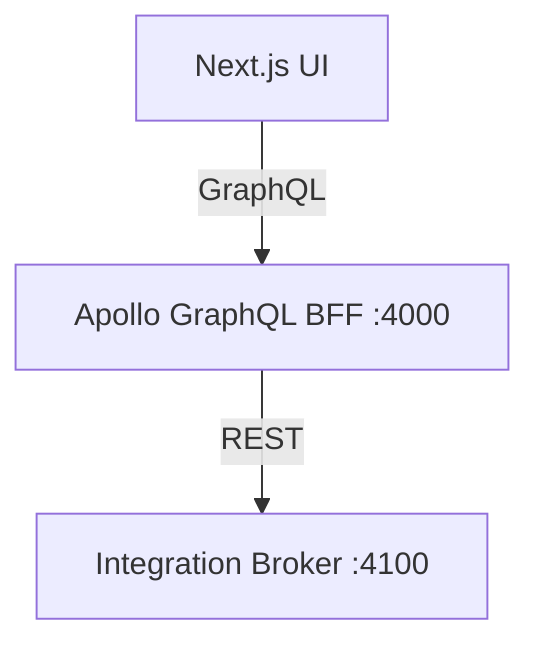
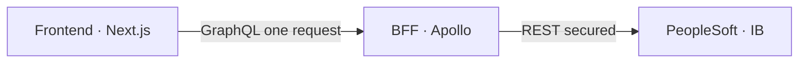
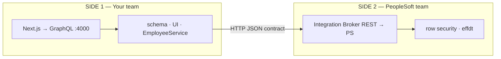
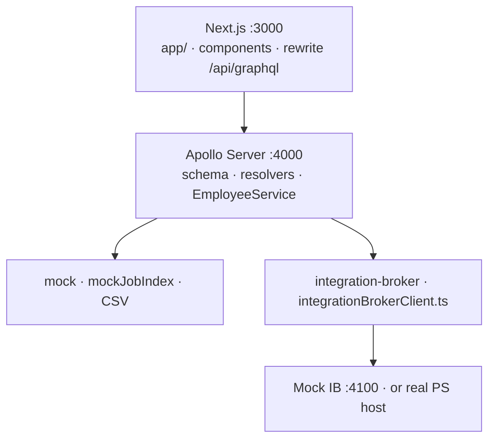
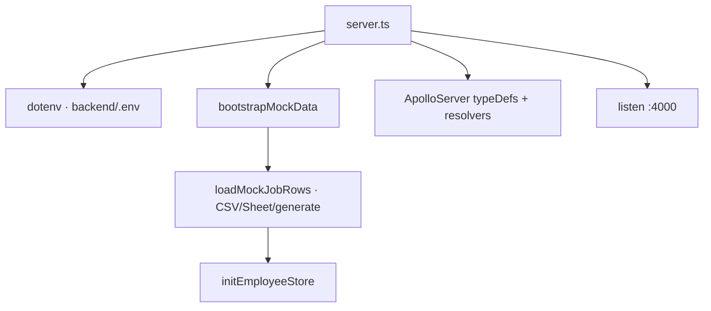
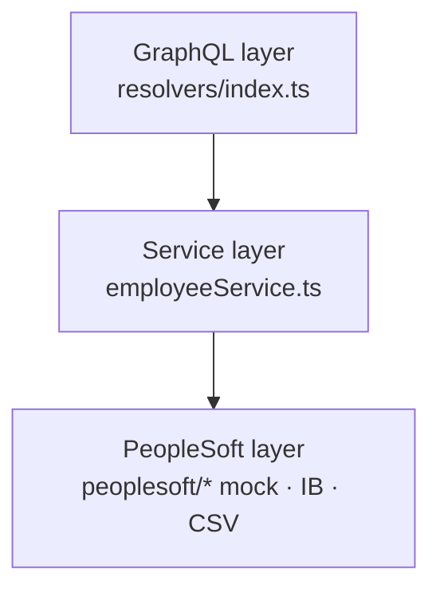
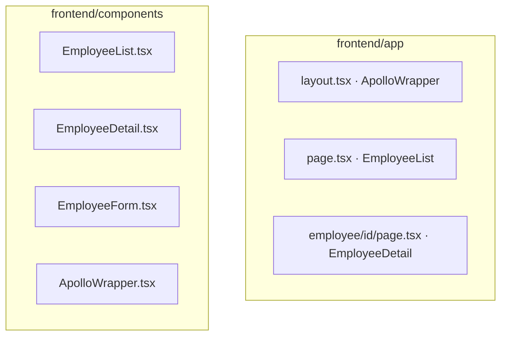
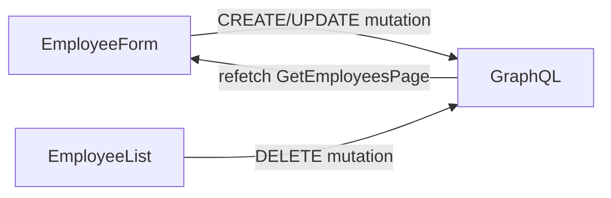
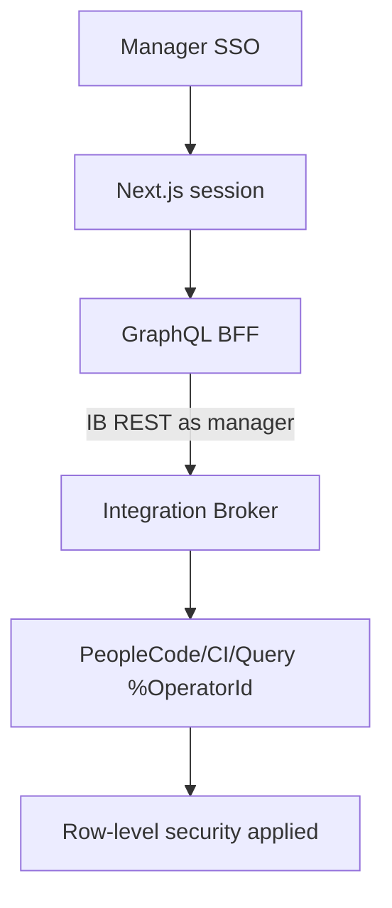
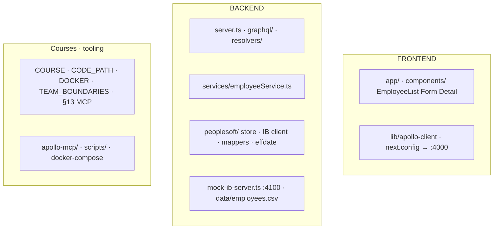

# Using GraphQL to get PeopleSoft data



**Audience:** Developers who know JavaScript/TypeScript and want to understand this project from **browser → GraphQL → PeopleSoft (mock and real)**.

**Repo:** `peoplesoft-graphql-starter`  
**Time:** ~12–16 hours (self-paced)  
**Outcome:** You can trace any user action end-to-end, extend the API, and plan a production PeopleSoft Integration Broker integration with row security.

**New to PeopleSoft or GraphQL BFFs?** Read the short **[INTRODUCTION.md](./INTRODUCTION.md)** first (~15 min), then start Module 0 below.

---

## How to use this course

1. Clone/open the repo and complete **Module 0** setup.
2. Do each module in order; **Labs** are hands-on (required).
3. Use **Checkpoint questions** to verify understanding before moving on.
4. Use the repo [README.md](../README.md) as the **course hub** (overview, diagram, module map).
5. Deep dives: [TEAM_BOUNDARIES.md](./TEAM_BOUNDARIES.md), [CODE_PATH_GRAPHQL_TO_PS.md](CODE_PATH_GRAPHQL_TO_PS.md), [DOCKER_AND_IB_CONFIGURE.md](./DOCKER_AND_IB_CONFIGURE.md).
6. **Scripts ↔ course:** [SCRIPT_COURSE_LINKS.md](./SCRIPT_COURSE_LINKS.md) — each module’s **Scripts for this module** table links to `npm run` and source files; scripts link back (**To pick** when several apply).

| Module | Topic | ~Time | Primary commands → [SCRIPT_COURSE_LINKS](./SCRIPT_COURSE_LINKS.md) |
|--------|--------|-------|---------------------------------------------------------------------|
| 0 | Setup & first run | 45 min | `dev` |
| 1 | Why this architecture exists (+ team boundaries) | 1 h | (read); trace later with `dev:mock-ps` |
| 2 | The three runtimes (ports 3000/3001, 4000, 4100; optional 8000 §13) | 1 h | `dev`, `stack:stop` |
| 3 | GraphQL contract (schema & Sandbox) | 1.5 h | `dev:backend` |
| 4 | Backend: Apollo Server boot flow | 1 h | `dev:backend`, `typecheck` |
| 5 | Resolvers & EmployeeService | 1.5 h | `dev:backend` |
| 6 | PeopleSoft data layer (mock, CSV, store) | 2 h | `export:employees`, `sync:sheet` |
| 7 | Mock Integration Broker REST | 1.5 h | `dev:mock-ps`, `mock-ib` |
| 7b | Docker mock stack & IB configure map | 1 h | `stack:docker`, `stack:stop` |
| 8 | Frontend: Next.js + Apollo Client | 2 h | `dev:frontend`, `dev` |
| 9 | CRUD: mutations & forms | 1.5 h | `dev` or `dev:mock-ps` |
| 10 | Pagination & effective dating | 1 h | `dev` |
| 11 | Real PS Integration Broker & row security | 2 h | env + [PEOPLESOFT_IB_ROW_SECURITY](./PEOPLESOFT_IB_ROW_SECURITY.md) |
| 12 | Capstone & production checklist | 2 h | `build`, `stack:docker` |
| **§13** | **Advanced section: Apollo MCP & AI agents** (optional) | 2–3 h | `dev:with-mcp`, `dev:mcp`, `mcp:inspect` → [Section 13](./MODULE_13_APOLLO_MCP_AGENTS.md) |

---

## Module 0 — Setup & first run

### Scripts for this module

| Run | Script / entry |
|-----|----------------|
| `npm run dev` | [`backend/src/server.ts`](../backend/src/server.ts) + Next.js `dev` in [`frontend/package.json`](../frontend/package.json) |

Full index: [SCRIPT_COURSE_LINKS § Module 0](./SCRIPT_COURSE_LINKS.md#by-course-module-course--script).

### Goals

- Run frontend + backend locally.
- Open the employee list and Apollo Sandbox.

### Steps

```bash
cd ~/Documents/Projects/peoplesoft-graphql-starter
npm install
npm install --prefix backend
npm install --prefix frontend
cp backend/.env.example backend/.env
```

Ensure `backend/.env` contains:

```env
PORT=4000
PEOPLESOFT_DATA_SOURCE=mock
MOCK_DATA_SOURCE=auto
```

```bash
npm run dev
```

(See [root `package.json`](../package.json) `scripts.dev` — starts backend + frontend together.)

| URL | What |
|-----|------|
| http://localhost:3000 | Next.js UI |
| http://localhost:4000 | GraphQL (Apollo Sandbox) |

### Lab 0.1

1. Confirm three employees (or paginated list of 1000) on the home page.
2. Open http://localhost:4000 and run:

```graphql
query {
  employeeCount
  employees(limit: 3) {
    emplid
    name
  }
}
```

### Checkpoint

- What port does the **browser** talk to for GraphQL?
- What port does the **GraphQL server** listen on?

<details>
<summary>Answers</summary>

- Browser uses **3000** via `/api/graphql` (Next.js rewrite).
- Apollo listens on **4000**.

</details>

---

## Module 1 — Why this architecture exists

### Scripts for this module

No dedicated lab command — this module is **read + code trace**. After Module 0, use these when tracing Side 2:

| To pick | Run | Entry |
|---------|-----|--------|
| Mock CSV only | `npm run dev` | [`employeeService.ts`](../backend/src/services/employeeService.ts) (`mock`) |
| Mock IB HTTP | `npm run dev:mock-ps` | [`integrationBrokerClient.ts`](../backend/src/peoplesoft/integrationBrokerClient.ts) |

Index: [SCRIPT_COURSE_LINKS § Module 1](./SCRIPT_COURSE_LINKS.md#by-course-module-course--script) · [TEAM_BOUNDARIES.md](./TEAM_BOUNDARIES.md).

### The problem

PeopleSoft holds HR data in an enterprise database with **effective dating**, **row security**, and complex APIs. A modern React/Next UI should not:

- Connect directly to the database (forbidden, fragile).
- Call dozens of REST endpoints per screen (slow, rigid).
- Duplicate PeopleSoft business rules in the frontend.

### The pattern: BFF + GraphQL



**BFF** = Backend-for-Frontend: one API shaped for your UI.  
**GraphQL** = client asks only for the fields it needs.

### Two sides of the system

This repo mirrors how work is often split in the enterprise:



- **Side 1 is always the same:** the browser only calls `/api/graphql`. Your squad owns the schema, resolvers, and frontend.
- **Side 2 depends on config:** `PEOPLESOFT_DATA_SOURCE=mock` uses CSV/memory (no PS team, no HTTP). `integration-broker` uses `integrationBrokerClient.ts` → `fetch(PS_BASE_URL/...)` — the same code path you will use when the PS team delivers a real IB URL.

The frontend **never** talks to PeopleSoft directly. GraphQL is **internal** to your team; REST over Integration Broker is the **handshake with the other team**.

### Team boundaries at work

| Your team delivers | PeopleSoft team delivers |
|--------------------|---------------------------|
| GraphQL types & resolvers | IB service URLs and operations |
| Next.js pages & forms | JSON payloads (`EMPLID`, `NAME`, …) |
| `integrationBrokerClient.ts` (consumer) | Secured endpoints, auth, row security |
| `mappers.ts` (field mapping) | Effective dating & HR rules in PS |

**Local stand-ins** (mock IB :4100, Google Sheet Apps Script) simulate Side 2 so you can build Side 1 before PS is ready — they do not replace the PS team in production.

### Read

- Root [README.md](../README.md) — Architecture & two sides
- [TEAM_BOUNDARIES.md](./TEAM_BOUNDARIES.md) — org split, deliverables, questions for PS team
- [CODE_PATH_GRAPHQL_TO_PS.md](CODE_PATH_GRAPHQL_TO_PS.md) — trace Save → `fetch()` (commands in [SCRIPT_COURSE_LINKS](./SCRIPT_COURSE_LINKS.md))
- [README.md](../README.md) — course hub (diagram, module map, quick start)

### Lab 1.1 — Find the team boundary in code

1. Open `backend/src/services/employeeService.ts` — find where `dataSource` switches `mock` vs `integration-broker`.
2. Open `backend/src/peoplesoft/integrationBrokerClient.ts` — every `fetch()` is Side 2.
3. Open `frontend/components/EmployeeForm.tsx` — confirm there is **no** `PS_BASE_URL` or PeopleSoft URL (Side 1 only).

### Checkpoint

- Name two reasons **not** to query `PS_JOB` directly from Next.js.
- What does **effective dating** mean in HR data?
- What API does the **frontend** use vs what API does **your BFF** use to reach PeopleSoft?
- Who typically owns `integrationBrokerClient.ts` vs who implements the REST service behind `PS_BASE_URL`?

<details>
<summary>Answers (team boundaries)</summary>

- Frontend: **GraphQL** to your BFF only.
- BFF → PeopleSoft: **HTTP REST** via Integration Broker (when `integration-broker` is set).
- Your team maintains the client and mappers; the PS team (or their vendor) delivers and operates the IB REST service.

</details>

---

## Module 2 — The three runtimes (ports)

### Scripts for this module

| Run | Script / entry |
|-----|----------------|
| `npm run dev` | [`backend/src/server.ts`](../backend/src/server.ts) + frontend `dev` |
| `npm run stack:stop` | [`scripts/stop-dev-stack.sh`](../scripts/stop-dev-stack.sh) — free ports 3000, 3001, 4000, 4100, 8000 |

Index: [SCRIPT_COURSE_LINKS § Module 2](./SCRIPT_COURSE_LINKS.md#by-course-module-course--script).

### Map

**Ports:** local dev UI **3000**; Docker UI **3001** (avoids clash with local Next); GraphQL **4000**; mock IB **4100**; Apollo MCP Server **8000** ([Section 13](./MODULE_13_APOLLO_MCP_AGENTS.md), optional).



### Environment switch

| Variable | Values | Effect |
|----------|--------|--------|
| `PEOPLESOFT_DATA_SOURCE` | `mock` \| `integration-broker` | Where EmployeeService reads/writes |
| `MOCK_DATA_SOURCE` | `auto` \| `csv` \| `sheet` \| `generate` | How mock rows load at startup |

**Common mistake:** `PEOPLESOFT_DATA_SOURCE=integration-broker` without anything on port **4100** → `fetch failed`. Use `mock` for UI + CSV, or [`npm run dev:mock-ps`](../package.json) (starts [`mock-ib-server.ts`](../backend/src/mock-ib-server.ts) — Module 7).

### Lab 2.1 — Trace a request

1. Open DevTools → Network on http://localhost:3000.
2. Reload home page; find `graphql` POST to `/api/graphql`.
3. Read `frontend/next.config.ts` — find the rewrite rule.
4. Read `frontend/lib/apollo-client.ts` — find the URI.

### Files to bookmark

| File | Role |
|------|------|
| `frontend/next.config.ts` | Proxy GraphQL |
| `frontend/lib/apollo-client.ts` | Apollo Client config |
| `backend/src/server.ts` | Starts Apollo after data bootstrap |
| [`package.json`](../package.json) (root) | [`npm run dev`](../package.json) runs both processes |

### Checkpoint

- Why does the frontend use `/api/graphql` instead of `http://localhost:4000`?
- Which port is Side 1 only, and which optional port (:4100) stands in for Side 2?

---

## Module 3 — GraphQL contract

### Scripts for this module

| Run | Entry |
|-----|--------|
| `npm run dev:backend` | [`backend/src/server.ts`](../backend/src/server.ts) — Sandbox at http://localhost:4000 |
| `npm run dev` | Full stack (UI + Sandbox) |

Contract file: [`backend/src/graphql/schema.ts`](../backend/src/graphql/schema.ts). Index: [SCRIPT_COURSE_LINKS § Module 3](./SCRIPT_COURSE_LINKS.md#by-course-module-course--script).

### Schema as API documentation

Open `backend/src/graphql/schema.ts`.

```graphql
type Employee {
  emplid: ID!
  name: String!
  ...
}

type Query {
  employees(asOfDate: String, limit: Int, offset: Int): [Employee!]!
  employee(id: ID!, asOfDate: String): Employee
  employeeCount(asOfDate: String): Int!
}

type Mutation {
  createEmployee(input: EmployeeInput!): Employee!
  updateEmployee(emplid: ID!, input: EmployeeInput!): Employee!
  deleteEmployee(emplid: ID!): Boolean!
}
```

`deleteEmployee` **terminates** (eff-dated inactive row) — it does not remove job history. See [Module 9](#module-9--crud-mutations--forms) and [CODE_PATH § PS terminate vs delete](CODE_PATH_GRAPHQL_TO_PS.md#ps-terminate-vs-delete).

- **Query** = read
- **Mutation** = write
- **Type** = shape of data (`Employee`, `JobRecord`)

### Lab 3.1 — Sandbox exercises

At http://localhost:4000:

**List with pagination:**

```graphql
query {
  employeeCount
  employees(limit: 5, offset: 0) {
    emplid
    name
    department
  }
}
```

**One employee + manager (nested field):**

```graphql
query {
  employee(id: "100001") {
    name
    manager {
      emplid
      name
    }
    jobHistory {
      position
      startDate
      salary
    }
  }
}
```

**Effective dating (Jane Doe):**

```graphql
query {
  jane2024: employee(id: "100001", asOfDate: "2024-06-01") {
    name
    position
  }
  jane2026: employee(id: "100001", asOfDate: "2026-06-01") {
    name
    position
  }
}
```

### Lab 3.2 — Intentional error

Run `query { id }` and read the validation error. Understand: **`id` is not on `Query`** — it’s `emplid` on `Employee`.

### Checkpoint

- What is the difference between `employees` and `employee`?
- Why is `manager { name }` valid in a query?

---

## Module 4 — Backend boot flow

### Scripts for this module

| Run | Script / entry |
|-----|----------------|
| `npm run dev:backend` | [`backend/src/server.ts`](../backend/src/server.ts) (`tsx watch`) |
| `npm run typecheck` | TypeScript check in [`backend/package.json`](../backend/package.json) |

Index: [SCRIPT_COURSE_LINKS § Module 4](./SCRIPT_COURSE_LINKS.md#by-course-module-course--script).

### Startup sequence



### Files

| File | Purpose |
|------|---------|
| `bootstrapMockData.ts` | Load rows into store + index |
| `loadMockJobRows.ts` | CSV / Google Sheet / generator |
| `employeeStore.ts` | In-memory truth + CSV persist on CRUD |
| `mockJobIndex.ts` | Fast lookup by `emplid` |

### Lab 4.1

1. Start backend with log line: `Loading employees from .../employees.csv`.
2. Change `MOCK_DATA_SOURCE=generate` and `MOCK_EMPLOYEE_COUNT=10`; restart — see generator path in logs.
3. Restore `auto` and CSV.

### Checkpoint

- When does data load — on every request or once at startup?

---

## Module 5 — Resolvers & EmployeeService

### Scripts for this module

| Run | Entry |
|-----|--------|
| `npm run dev:backend` | [`resolvers/index.ts`](../backend/src/resolvers/index.ts), [`employeeService.ts`](../backend/src/services/employeeService.ts) |

Index: [SCRIPT_COURSE_LINKS § Module 5](./SCRIPT_COURSE_LINKS.md#by-course-module-course--script).

### Separation of concerns



### Resolver example (read path)

```typescript
// resolvers/index.ts
employees: async (_, args, ctx) => {
  const rows = await ctx.employeeService.listEmployees(
    args.asOfDate,
    args.limit,
    args.offset,
  );
  return rows.map((row) => ({ ...row, asOfDate: args.asOfDate ?? null }));
},
```

### EmployeeService switch

```typescript
// mock path → mockJobIndex + effectiveDating
// integration-broker path → integrationBrokerClient.fetch(...)
```

### Context injection

`graphql/context.ts` creates one `EmployeeService` per request (from env).

### Lab 5.1 — Code trace

1. Pick `employees` query in Sandbox.
2. Set a breakpoint or add `console.log` in `listEmployees` (mock branch).
3. Confirm pagination: `limit`/`offset` slice `mockEmplids`.

### Lab 5.2 — Draw a sequence diagram

On paper, trace: `EmployeeList` → `useQuery` → resolver → `listEmployees` → `pickActiveEffectiveRow` → return JSON.

### Checkpoint

- Why don’t resolvers import `mockJobRows` directly?
- What would break if you skipped `EmployeeService`?

---

## Module 6 — PeopleSoft data layer (mock & CSV)

### Scripts for this module

| Run | Script file |
|-----|-------------|
| `npm run export:employees` | [`backend/scripts/export-employees-csv.ts`](../backend/scripts/export-employees-csv.ts) → writes [`backend/data/employees.csv`](../backend/data/employees.csv) |
| `npm run sync:sheet` | [`backend/scripts/sync-employees-from-sheet.ts`](../backend/scripts/sync-employees-from-sheet.ts) |

Also: [GOOGLE_SHEETS.md](./GOOGLE_SHEETS.md) (same commands). Index: [SCRIPT_COURSE_LINKS § Module 6](./SCRIPT_COURSE_LINKS.md#by-course-module-course--script).

### Mental model: PS_JOB-style rows

One **employee** (`emplid`) can have **many rows** over time (`effdt`, `hr_status`, position, salary).  
**Effective dating** picks the row valid on `asOfDate`; **active status** (`hr_status` `A` vs `I`/`T`) controls list/get visibility.

| File | Role |
|------|------|
| `types.ts` | `JobRow`, `EmployeeRecord` (`hrStatus`) |
| `effectiveDating.ts` | `pickEffectiveRow` (as-of), `pickActiveEffectiveRow` (as-of + active `hr_status`) |
| `jobHistory.ts` | `jobRowToEmployee`, `buildJobHistory` |
| `generateMockJobRows.ts` | 1000 synthetic employees |
| `csvEmployees.ts` | Parse/write CSV |
| `data/employees.csv` | Editable dataset |

### Google Sheets workflow

See [GOOGLE_SHEETS.md](./GOOGLE_SHEETS.md).

```bash
npm run export:employees   # → backend/scripts/export-employees-csv.ts
npm run sync:sheet         # → backend/scripts/sync-employees-from-sheet.ts
```

### Lab 6.1

1. Edit `employees.csv` — change Jane Doe’s department.
2. Restart backend; confirm UI update.
3. Import CSV to Google Sheets; edit one row; download back to `employees.csv`; restart.

### Checkpoint

- Why are Jane’s two rows both `emplid: 100001`?
- Where is the “source of truth” in dev mode after CRUD?

---

## Module 7 — Mock Integration Broker

### Scripts for this module

| Run | Script / entry |
|-----|----------------|
| `npm run dev:mock-ps` | [`mock-ib-server.ts`](../backend/src/mock-ib-server.ts) + [`server.ts`](../backend/src/server.ts) + frontend |
| `npm run mock-ib` | [`backend/src/mock-ib-server.ts`](../backend/src/mock-ib-server.ts) only (port **4100**) |

HTTP routes: [`mockIntegrationBroker/server.ts`](../backend/src/peoplesoft/mockIntegrationBroker/server.ts). Index: [SCRIPT_COURSE_LINKS § Module 7](./SCRIPT_COURSE_LINKS.md#by-course-module-course--script).

### Why mock IB?

To practice the **`integration-broker`** code path without a PeopleSoft environment.

```bash
cp backend/.env.mock-ib.example backend/.env   # sets PEOPLESOFT_DATA_SOURCE=integration-broker + PS_BASE_URL=:4100
npm run dev:mock-ps   # mock-ib-server.ts + server.ts + frontend (see backend/src/mock-ib-server.ts)
```

Three processes: **mock-ps :4100**, **backend :4000**, **frontend :3000**.

### PS-shaped JSON

Mock returns `EMPLID`, `EMAIL_ADDR`, `EFFDT`, `HR_STATUS`, etc. ([`payloads.ts`](../backend/src/peoplesoft/mockIntegrationBroker/payloads.ts) — `jobRowToPsBrokerRow`).  
`mappers.ts` converts → internal `EmployeeRecord` (**inbound only** today).

**Two-way mapping (design):** Outbound POST/PUT still send camelCase JSON; production IB usually needs PS field names on writes. Full field table, limitations (`manager`, `jobHistory`, `effectiveDate`), and implementation steps — [CODE_PATH § Two-way mapping](CODE_PATH_GRAPHQL_TO_PS.md#two-way-mapping).

### Lab 7.1

```bash
curl -u demo:demo "http://localhost:4100/employees?limit=2"
curl -u demo:demo "http://localhost:4100/employee/100001"
```

Read `mockIntegrationBroker/server.ts` and `payloads.ts`.

### Lab 7.2 — Compare paths

| Config | Data path |
|--------|-----------|
| `PEOPLESOFT_DATA_SOURCE=mock` | Memory/CSV, no HTTP to 4100 |
| `PEOPLESOFT_DATA_SOURCE=integration-broker` + `PS_BASE_URL=http://localhost:4100` | HTTP to mock IB |

### Checkpoint

- What does `integrationBrokerClient.ts` do?
- Why is `mappers.ts` required?
- Inbound vs outbound: which direction is implemented today? ([answer](CODE_PATH_GRAPHQL_TO_PS.md#two-way-mapping))

---

## Module 7b — Docker mock stack & Integration Broker configure map

**Read:** [DOCKER_AND_IB_CONFIGURE.md](./DOCKER_AND_IB_CONFIGURE.md) (full labs and PS PeopleTools mapping).

> **IMPORTANT:** Docker services in [`docker-compose.yml`](../docker-compose.yml) (`frontend`, `backend`, `mock-ps`) are **dev environment only** — not for production.

**Read next for production:** [DOCKER_AND_IB § Dev vs production](./DOCKER_AND_IB_CONFIGURE.md#dev-vs-production-environments-explained) and [§ How to configure production](./DOCKER_AND_IB_CONFIGURE.md#how-to-configure-the-production-environment).

### Scripts for this module

| Run | Script / config |
|-----|-----------------|
| `npm run stack:docker` | [`docker-compose.yml`](../docker-compose.yml) (`docker compose up --build`) |
| `npm run stack:stop` | [`scripts/stop-dev-stack.sh`](../scripts/stop-dev-stack.sh) |

Same app as [`npm run dev:mock-ps`](../package.json) but containerized. Index: [SCRIPT_COURSE_LINKS § Module 7b](./SCRIPT_COURSE_LINKS.md#by-course-module-course--script).

### Goals

- Run **mock-ps + backend + frontend** with `docker compose up --build`.
- Relate Docker env vars (`PS_BASE_URL`, `PS_USERNAME`) to what the **PeopleSoft team** sets in Integration Broker.
- Know when to **restart** containers after code/env changes.
- Explain why **mock PS in Docker is good for dev** but **real PS is not containerized** in this project.
- Describe **how production** should be configured (`PS_BASE_URL`, no `mock-ps`, secrets, PS team deliverables).

### Dev vs production (read before labs)

| | Development | Production |
|--|-------------|------------|
| Docker `mock-ps` | ✅ Teaching / local only | ❌ Never |
| `PS_BASE_URL` | `http://mock-ps:4100` or localhost | PS team’s real IB HTTPS URL |
| Full guide | [DOCKER_AND_IB § Dev vs production](./DOCKER_AND_IB_CONFIGURE.md#dev-vs-production-environments-explained) | [§ Production configuration](./DOCKER_AND_IB_CONFIGURE.md#how-to-configure-the-production-environment) |

### Architecture decision (read first)

**[DOCKER_AND_IB_CONFIGURE.md § Architecture decision](./DOCKER_AND_IB_CONFIGURE.md#architecture-decision-should-peoplesoft-be-a-docker-component)**

| Question | Answer |
|----------|--------|
| Docker mock PS (`mock-ps`)? | ✅ Dev, course, CI — simulates Integration Broker REST |
| Real PeopleSoft in Docker? | ❌ PS team hosts PS + IB on your site |
| Production compose services? | `frontend` + `backend` only; `PS_BASE_URL` → real IB |

> Docker for **mock** IB = good. Docker for **real** PeopleSoft = no.

### Quick start

```bash
npm run stack:docker
# same as: docker compose up --build  (see docker-compose.yml)
```

Open http://localhost:3001 — same app as [`npm run dev:mock-ps`](../package.json), but all three services run in containers (Docker uses host port **3001** so local `npm run dev` on 3000 can still run).

### What you would see in real PeopleSoft (summary)

| PeopleTools / IB | This repo (mock or .env) |
|------------------|---------------------------|
| Service definition (REST) | `mock-ps` on :4100 |
| Service operations (GET /employees, …) | `mockIntegrationBroker/server.ts` routes |
| Published external URL | `PS_BASE_URL` |
| Service user + password | `PS_USERNAME` / `PS_PASSWORD` |
| JSON field names (EMPLID, …) | `mappers.ts` |

Detailed tables and PeopleTools navigation: **DOCKER_AND_IB_CONFIGURE.md** and comment block at top of **`docker-compose.yml`**.

### Lab 7b.1

1. [`npm run stack:docker`](../package.json) — confirm three containers healthy (see [`docker-compose.yml`](../docker-compose.yml)).
2. `curl -u demo:demo http://localhost:4100/employees?limit=2`
3. Open UI list — confirm employees load through GraphQL (not direct to :4100 from browser).

### Lab 7b.2 — Read configure comments

1. Open `docker-compose.yml` — read the Integration Broker configure comment block.
2. Open `backend/.env.example` — match each variable to an IB concept.
3. Answer checkpoint questions at end of DOCKER_AND_IB_CONFIGURE.md.

### Checkpoint

- Why are three Docker services required for the mock stack?
- Where is IB actually configured — in compose or in PeopleTools?
- What URL goes in `PS_BASE_URL` for production?
- Is `mock-ps` real PeopleSoft? Should it run in production?
- Name one benefit of Docker mock PS and one thing it cannot simulate.

---

## Module 8 — Frontend: Next.js + Apollo Client

### Scripts for this module

| Run | Entry |
|-----|--------|
| `npm run dev:frontend` | Next.js dev server — [`frontend/package.json`](../frontend/package.json) |
| `npm run dev` | Full stack (if backend already running separately, use `dev:frontend` only) |

Index: [SCRIPT_COURSE_LINKS § Module 8](./SCRIPT_COURSE_LINKS.md#by-course-module-course--script).


### App Router structure



### Client components

Files with `"use client"` use hooks (`useQuery`, `useMutation`, `useState`).

### Data fetching pattern

```typescript
const { data, loading, error } = useQuery(GET_EMPLOYEES_PAGE, {
  variables: { limit: 50, offset: 0 },
});
```

Apollo Client:

1. Sends POST to `/api/graphql`
2. Caches by query name
3. Re-renders on data/error/loading

### Lab 8.1

1. In `EmployeeList.tsx`, find `GET_EMPLOYEES_PAGE` — list fields requested.
2. Add `position` to the query (if not present) and confirm UI shows it.
3. Open React DevTools — find Apollo cache.

### Lab 8.2 — Detail page

1. Navigate to Jane Doe; use date picker + Apply.
2. Trace `EmployeeDetail.tsx` → `GET_EMPLOYEE` with `asOfDate`.

### Checkpoint

- What is the difference between `page.tsx` and `EmployeeList.tsx`?
- Why is Apollo configured with `uri: "/api/graphql"`?

---

## Module 9 — CRUD: mutations & forms

### Scripts for this module

| Mode | Run | Trace |
|------|-----|--------|
| CSV CRUD (default) | `npm run dev` | [CODE_PATH § Mode A](CODE_PATH_GRAPHQL_TO_PS.md#mode-a--graphql--csv-current-default) |
| HTTP to mock IB | `npm run dev:mock-ps` | [CODE_PATH § Mode B](CODE_PATH_GRAPHQL_TO_PS.md#mode-b--graphql--http--mock-ps-see-fetch) |

Index: [SCRIPT_COURSE_LINKS § Module 9](./SCRIPT_COURSE_LINKS.md#by-course-module-course--script).

### GraphQL mutations (backend)

| Mutation | `mock` path | `integration-broker` path |
|----------|-------------|---------------------------|
| `createEmployee` | `createEmployeeInStore` → CSV | `integrationBrokerClient.createEmployee` → HTTP POST |
| `updateEmployee` | `updateEmployeeInStore` → CSV | `integrationBrokerClient.updateEmployee` → HTTP PUT |
| `deleteEmployee` | `terminateEmployeeInStore` → new CSV row (`hr_status=I`) | `integrationBrokerClient.deleteEmployee` → **PUT** terminate (`effdt`, `hrStatus`) |

Side 1 (resolver) is the same for both; Side 2 is chosen in `employeeService.ts`.

> **PeopleSoft:** No hard delete — eff-dated terminate. The app **implements this** (row stays in CSV; UI list hides inactive). See [CODE_PATH § PS terminate vs delete](CODE_PATH_GRAPHQL_TO_PS.md#ps-terminate-vs-delete).

### Frontend flow



### Lab 9.1

1. Add employee via UI; verify new row in `employees.csv`.
2. Edit department; verify CSV.
3. Delete; verify employee disappears from UI but a new row with `hr_status=I` exists in `employees.csv` (eff-dated terminate).

### Lab 9.2 — Mutation in Sandbox

```graphql
mutation {
  createEmployee(input: {
    name: "Test User"
    department: "IT"
    position: "Analyst"
    salary: 70000
  }) {
    emplid
    name
  }
}
```

### Checkpoint

- Where does `createEmployee` go when `PEOPLESOFT_DATA_SOURCE=mock` vs `integration-broker`?
- In production, which team owns the endpoint your BFF calls on save?

---

## Module 10 — Pagination & effective dating

### Scripts for this module

| Run | Entry |
|-----|--------|
| `npm run dev` | [`EmployeeList.tsx`](../frontend/components/EmployeeList.tsx), [`effectiveDating.ts`](../backend/src/peoplesoft/effectiveDating.ts) |

Index: [SCRIPT_COURSE_LINKS § Module 10](./SCRIPT_COURSE_LINKS.md#by-course-module-course--script).

### Pagination

- GraphQL: `employees(limit, offset)` + `employeeCount`
- UI: 50 per page, Previous/Next
- Mock IB: `?limit=50&offset=0`

### Effective dating

- Query arg: `asOfDate: "2024-06-01"`
- Backend: `pickEffectiveRow` (as-of snapshot); list/count use `pickActiveEffectiveRow` (as-of + active `hr_status`)
- UI: date bar on detail page

### Lab 10.1

1. Navigate to page 2 of list — watch `offset: 50` in Network payload.
2. Compare Jane at 2024 vs 2026 (Module 3 query).

### Checkpoint

- Why not return all 1000 employees to the browser at once?

---

## Module 11 — Real PeopleSoft & row security

### Scripts for this module

| Environment | Run | Notes |
|-------------|-----|--------|
| Compare dev mock | `npm run dev:mock-ps` | Demo only — no real row security |
| Production | (no starter script) | Set `PS_BASE_URL` in `.env`; BFF calls [`integrationBrokerClient.ts`](../backend/src/peoplesoft/integrationBrokerClient.ts) |

Index: [SCRIPT_COURSE_LINKS § Module 11](./SCRIPT_COURSE_LINKS.md#by-course-module-course--script) · [PEOPLESOFT_IB_ROW_SECURITY.md](./PEOPLESOFT_IB_ROW_SECURITY.md).

### Working with the PeopleSoft team

Re-read [TEAM_BOUNDARIES.md](./TEAM_BOUNDARIES.md) before production planning.

Your integration checklist with the PS team:

1. Get **non-prod** `PS_BASE_URL` and test credentials.
2. Obtain **sample JSON** for list / get / write operations.
3. Align **field names** in `mappers.ts` with their payload.
4. Agree how the BFF passes **user identity** so row security applies (see row-security doc below).
5. Do **not** put shared HR admin passwords in the browser — only server-side calls to IB.

### Production path



### Read thoroughly

- [DOCKER_AND_IB_CONFIGURE.md](./DOCKER_AND_IB_CONFIGURE.md) — Part C–F (operation map, real PS cutover)
- [PEOPLESOFT_IB_ROW_SECURITY.md](./PEOPLESOFT_IB_ROW_SECURITY.md)

### Concepts to internalize

| Topic | Dev (this repo) | Production |
|-------|-----------------|------------|
| Auth | None | SSO + per-user PS token |
| Row security | You edit CSV | PS enforces by operator |
| CRUD | CSV file | IB → Component Interface |
| Delete | Eff-dated terminate (`hr_status=I` in CSV) | Same — `EFFDT` + `HR_STATUS`; history kept |

### Lab 11.1 — Design doc (written)

Write half a page answering:

1. Who is the authenticated user?
2. Which IB operations map to list / get / update?
3. How do you prove two managers see different lists?
4. **Team split:** List three deliverables your squad owns vs three the PeopleSoft team owns.

### Checkpoint

- Can Integration Broker bypass row security?
- Why should the browser never hold a shared HR Admin password?

---

## Module 12 — Capstone project

### Scripts for this module

| Run | Use |
|-----|-----|
| `npm run build` | Production build (backend `tsc` + frontend `next build`) |
| `npm run stack:docker` | (To pick) Ops track — containerized demo |
| `npm run dev` / `dev:mock-ps` | Feature tracks — local dev |

Index: [SCRIPT_COURSE_LINKS § Module 12](./SCRIPT_COURSE_LINKS.md#by-course-module-course--script).

### Choose one track

**Track A — Feature extension**

- Add search: `employees(search: String)` filtering name/emplid.
- Add department filter dropdown on the home page.

**Track B — Integration readiness**

- Document real `PS_BASE_URL` paths and JSON samples in `integrationBrokerClient.ts`.
- Add a one-page **team contract** appendix (your GraphQL vs their IB REST) — use [TEAM_BOUNDARIES.md](./TEAM_BOUNDARIES.md) as template.
- Add `PsAuth` placeholder to `context.ts` (no real SSO required).

**Track C — Operations**

- Add health query: `health { status employeeCount dataSource }`.
- Document runbook: ports, env vars, common errors.

### Deliverables

1. PR or branch with code + README snippet.
2. Sequence diagram of your feature.
3. Demo video or screenshots (optional).

### Grading rubric (self-check)

| Criteria | Done |
|----------|------|
| Traces request across 3 layers | ☐ |
| Can explain Side 1 vs Side 2 and team ownership | ☐ |
| Uses env switches correctly | ☐ |
| Does not break mock/IB modes | ☐ |
| Documents PS security implications | ☐ |

---

## Section 13 (Advanced, optional) — Apollo MCP Server & AI agents

**Full lab write-up:** [MODULE_13_APOLLO_MCP_AGENTS.md](./MODULE_13_APOLLO_MCP_AGENTS.md) (file name kept for links; content is **Section 13**).

Apollo’s **Agents** stack in three layers — and what changes in *this* repo at each step:

| Layer | Role | Core course (0–12) | Section 13 change |
|-------|------|--------------------|-------------------|
| **Agents** | AI host (Cursor, ChatGPT, …) calls your API | Humans use Next.js only | Configure host MCP → `http://127.0.0.1:8000/mcp` |
| **Apollo MCP Server** | GraphQL operations → MCP tools → BFF :4000 | BFF on :4000 only | Add `apollo-mcp/`, `npm run dev:mcp` (:8000) |
| **MCP Apps Client** | Visual React UI inside chat (“visual components”) | Not present | **Separate** AI Apps template project; same GraphQL endpoint |

**Implemented here:** layers 1–2 (labs). **Layer 3** is documented in [MODULE_13 § MCP Apps Client](./MODULE_13_APOLLO_MCP_AGENTS.md#mcp-apps-client-visual-components--layer-3). GraphQL resolvers do **not** need rewrites for MCP — only exposure config and (for layer 3) a new UI app.

### Scripts for this section

| Run | Entry |
|-----|--------|
| `npm run dev:with-mcp` | [`server.ts`](../backend/src/server.ts) + [`run-apollo-mcp.sh`](../scripts/run-apollo-mcp.sh) |
| `npm run dev:mcp` | [`apollo-mcp/mcp.local.yaml`](../apollo-mcp/mcp.local.yaml) → MCP **:8000** |
| `npm run mcp:install` | [`install-apollo-mcp.sh`](../scripts/install-apollo-mcp.sh) |
| `npm run mcp:inspect` | MCP Inspector → `http://127.0.0.1:8000/mcp` |

### Quick start

```bash
npm run dev:backend    # Terminal 1 — GraphQL :4000
npm run dev:mcp        # Terminal 2 — MCP :8000
npm run mcp:inspect    # Verify GetEmployeesPage, etc.
```

Connect Cursor: see [`apollo-mcp/cursor-mcp.example.json`](../apollo-mcp/cursor-mcp.example.json).

### Checkpoint

- Name the three layers: **Agents**, **Apollo MCP Server**, **MCP Apps Client** — what does each add?
- What is **unchanged** in `backend/` when you enable MCP?
- What is the difference between **text tool results** (layer 2) and **visual components** (layer 3)?
- What port does the **human UI** use vs the **MCP server**?

---

## File map (cheat sheet)



---

## Troubleshooting guide

| Symptom | Likely cause | Fix |
|---------|--------------|-----|
| `fetch failed` on UI | `integration-broker` but nothing on :4100 | `PEOPLESOFT_DATA_SOURCE=mock` or [`npm run dev:mock-ps`](../package.json) → [`mock-ib-server.ts`](../backend/src/mock-ib-server.ts) |
| `EADDRINUSE` on 3000/4000/4100/8000 | Docker + local both running | [`npm run stack:stop`](../package.json) → [`scripts/stop-dev-stack.sh`](../scripts/stop-dev-stack.sh) |
| `EADDRINUSE :4000` | Old backend process | `kill $(lsof -t -iTCP:4000 -sTCP:LISTEN)` or [`npm run stack:stop`](../package.json) |
| Empty list | Bad CSV / empty parse | Check `employees.csv` headers (include `hr_status` or re-export) |
| Delete “did nothing” in CSV | Row count unchanged by design | Expect **new** row with `hr_status=I`; list hides inactive — [Module 9](#module-9--crud-mutations--forms) |
| Mutations fail | `integration-broker` but nothing on :4100, or wrong `PS_BASE_URL` | [`npm run dev:mock-ps`](../package.json) for local IB, or `PEOPLESOFT_DATA_SOURCE=mock` for CSV-only |
| Jane title unchanged | Wrong `asOfDate` | Try 2024-06-01 vs 2026-06-01 |
| Sheet sync fails | Missing URL | Set `GOOGLE_SHEET_CSV_URL` in `.env`; run [`npm run sync:sheet`](../package.json) → [`sync-employees-from-sheet.ts`](../backend/scripts/sync-employees-from-sheet.ts) |

---

## Commands reference

Full table with course module links (and **To pick** alternates): **[SCRIPT_COURSE_LINKS.md](./SCRIPT_COURSE_LINKS.md)**.

```bash
npm run dev              # → server.ts + Next (Module 0)
npm run dev:mock-ps      # → mock-ib-server.ts + server.ts + Next (Module 7)
npm run dev:backend      # → backend/src/server.ts (Module 4)
npm run dev:frontend     # → frontend dev (Module 8)
npm run export:employees # → backend/scripts/export-employees-csv.ts (Module 6)
npm run sync:sheet       # → backend/scripts/sync-employees-from-sheet.ts (Module 6)
npm run typecheck        # backend/ (Module 4–5)
npm run stack:stop       # → scripts/stop-dev-stack.sh (Module 2, 7b)
npm run stack:docker     # → docker-compose.yml (Module 7b)
npm run dev:mcp          # → apollo-mcp + scripts/run-apollo-mcp.sh (Section 13)
npm run dev:with-mcp     # → backend + MCP (Section 13)
npm run mcp:install      # → scripts/install-apollo-mcp.sh (Section 13)
npm run mcp:inspect      # MCP Inspector (Section 13)
```

Each command ↔ file ↔ module: **[SCRIPT_COURSE_LINKS.md](./SCRIPT_COURSE_LINKS.md)**.

---

## Suggested reading order (docs)

1. [README.md](../README.md) — course hub + module/command map
2. [README.md](../README.md) — repo quick start
3. [SCRIPT_COURSE_LINKS.md](./SCRIPT_COURSE_LINKS.md) — keep open while running labs
4. [TEAM_BOUNDARIES.md](./TEAM_BOUNDARIES.md) — after Module 1
5. [CODE_PATH_GRAPHQL_TO_PS.md](CODE_PATH_GRAPHQL_TO_PS.md) — Modules 6–9
6. [GOOGLE_SHEETS.md](./GOOGLE_SHEETS.md) — Module 6 lab
7. [DOCKER_AND_IB_CONFIGURE.md](./DOCKER_AND_IB_CONFIGURE.md) — Module 7b
8. [PEOPLESOFT_IB_ROW_SECURITY.md](./PEOPLESOFT_IB_ROW_SECURITY.md) — Module 11
9. [MODULE_13_APOLLO_MCP_AGENTS.md](./MODULE_13_APOLLO_MCP_AGENTS.md) — optional advanced **section**
10. [Apollo GraphQL docs](https://www.apollographql.com/docs)
11. [Apollo MCP Server docs](https://www.apollographql.com/docs/apollo-mcp-server/)
12. [Next.js App Router](https://nextjs.org/docs)

---

## Instructor notes (for mentors)

- **Week 1:** Modules 0–5 (architecture + GraphQL + backend).
- **Week 2:** Modules 6–10 (data, IB mock, frontend, CRUD).
- **Week 3:** Module 11–12 (PS security + capstone).
- **Optional week 4:** Section 13 (Apollo MCP + agents).

Pair beginners with Sandbox exercises before React.  
Emphasize **env misconfiguration** early to prevent `fetch failed` confusion.

---

*Course version: 1.2 — includes optional Section 13 (Apollo MCP Server) and two-way [SCRIPT_COURSE_LINKS](./SCRIPT_COURSE_LINKS.md).*
