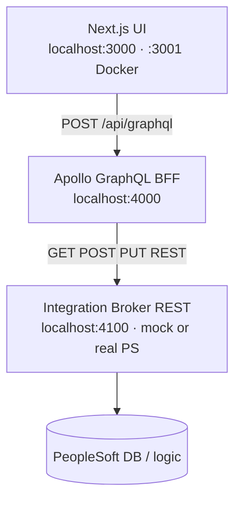
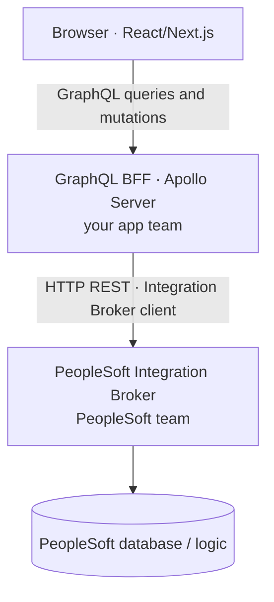

# Introduction: Using GraphQL to get PeopleSoft data

A short orientation before [COURSE.md](./COURSE.md) Modules 0–12.




**Audience:** Developers who know JavaScript/TypeScript and want to connect a modern UI to PeopleSoft-style HR data without learning PeopleTools first.

**Time:** ~15 minutes to read · first lab in Module 0: ~30 minutes

---

## What is PeopleSoft (in this course)?

**Oracle PeopleSoft** is an enterprise HR and campus system. Production data lives in a large relational database (often Oracle), but **your application should not query that database directly**.

On a real site, integrations go through **PeopleTools** and the **Integration Broker (IB)**:

- IB exposes **REST** (or SOAP) services your team publishes.
- Each service has operations such as list employees, get one employee, create, update, terminate.
- **Row security** and business rules run in PeopleSoft — not in your React app.

This starter **does not** install PeopleSoft or Oracle. It teaches the **integration pattern** using mocks you control locally.

---

## Why add GraphQL?

PeopleSoft REST is **resource-oriented** and **PS-shaped** (field names, effective dating, terminate vs delete). Your product UI wants **one API** tuned for screens: nested fields, pagination, stable types.



| Layer | Who owns it | This repo |
|-------|-------------|-----------|
| UI | Your frontend team | `frontend/` (Next.js + Apollo Client) |
| GraphQL BFF | Your app team | `backend/` resolvers + `EmployeeService` |
| IB REST | PeopleSoft / integration team | Mock at `:4100` or real `PS_BASE_URL` |

**GraphQL is the contract for your UI.** The BFF translates to IB REST and maps PS JSON into GraphQL types.

---

## What you will learn

By the end of the course you can:

1. **Trace** a button click from the browser through resolvers to mock (or real) IB.
2. **Read and extend** the GraphQL schema (`employees`, `employee`, mutations, `jobHistory`, effective dates).
3. **Run three modes:** in-memory/CSV mock, local **mock Integration Broker**, Docker stack, and (conceptually) real PS.
4. **Understand terminate semantics** — PeopleSoft marks employees inactive on an effective-dated row; it does not hard-delete history.
5. **Plan production** — credentials, `PS_BASE_URL`, row security, and what stays out of the browser.

Optional: [Section 13 — Apollo MCP & agents](./MODULE_13_APOLLO_MCP_AGENTS.md) for AI tooling on top of the same GraphQL API.

---

## The stack in one picture

**Ports:** UI **3000** (local) or **3001** (Docker) · GraphQL **4000** · Mock PS **4100**. Use **one** run mode at a time — see [README § Port conflicts](../README.md#port-conflicts-docker-vs-npm-run-dev).

---

## How this course is organized

| Doc | Purpose |
|-----|---------|
| **This intro** | Concepts and map |
| [COURSE.md](./COURSE.md) | Full path: labs, checkpoints, Modules 0–12 |
| [README.md](./README.md) | Hub + module index |
| [CODE_PATH_GRAPHQL_TO_PS.md](./CODE_PATH_GRAPHQL_TO_PS.md) | File-by-file trace + dev logs |
| [TEAM_BOUNDARIES.md](./TEAM_BOUNDARIES.md) | App team vs PeopleSoft team |

**Suggested path:** Read this page → Module 0 (install + first query) → Module 1 (why the layers exist) → continue in order.

---

## First steps (Module 0 preview)

```bash
cd ~/Documents/Projects/peoplesoft-graphql-starter
npm install
npm install --prefix backend && npm install --prefix frontend
cp backend/.env.example backend/.env
npm run dev
```

| URL | What |
|-----|------|
| http://localhost:3000 | Employee list UI |
| http://localhost:4000 | GraphQL Sandbox |

Example query in Sandbox:

```graphql
query {
  employeeCount
  employees(limit: 5) {
    emplid
    name
    department
    effectiveDate
  }
}
```

For mock IB + trace logs in files:

```bash
cp backend/.env.mock-ib.example backend/.env
npm run dev:mock-ps
npm run logs:follow   # optional: tail logs/*.log
```

---

## Key ideas to remember

1. **Do not** call Oracle from the browser or from GraphQL in production — use **Integration Broker REST**.
2. **Effective dating** — “current” employee rows depend on `asOfDate` and `HR_STATUS` (active vs inactive).
3. **Delete in the UI** means **terminate** in PS terms (inactive row), not remove history.
4. **Mapping is two-way in concept** — inbound PS JSON → GraphQL types today; outbound mapping for writes is documented as you extend the client.
5. **Mocks are for learning** — `docker-compose.yml` and mock IB are **dev/lab only**; production uses real IB URLs and secrets in `backend/.env` (never in the frontend).

---

## When you are ready

Open **[COURSE.md — Module 0](./COURSE.md#module-0--setup--first-run)** and complete the first lab.

Questions while reading? Use [SCRIPT_COURSE_LINKS.md](./SCRIPT_COURSE_LINKS.md) to jump from any `npm run` command to the module that explains it.
