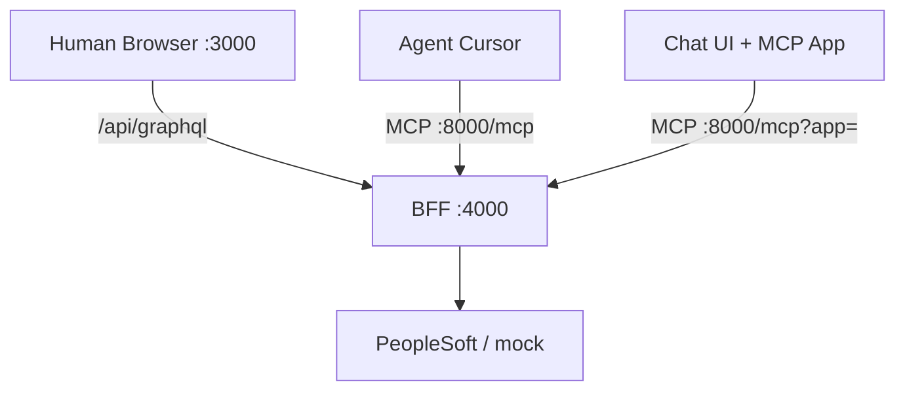

# Section 13 (Advanced) — Apollo MCP Server & AI agents

**Prerequisites:** Modules 0–5 (GraphQL contract + backend). Module 7+ helpful for Side 2 context.  
**Optional:** Module 12 capstone complete.  
**Time:** ~2–3 hours  
**Outcome:** Understand Apollo’s **Agents → Apollo MCP Server → MCP Apps Client** stack: what each layer does, what this repo already has, and **what you must add or change** at each step.

**Scripts:** [SCRIPT_COURSE_LINKS § Section 13](./SCRIPT_COURSE_LINKS.md#by-course-module-course--script)

---

## Apollo’s three layers (what changes at each step)

Apollo describes **Agents** as: *expose your graph and tools to AI assistants; enhance chat responses with visual components.* That breaks into three products/layers:

```mermaid
flowchart LR
  AG[Agents<br/>AI host] -->|MCP tools/resources| MCP[Apollo MCP Server<br/>:8000]
  APP[MCP Apps Client<br/>visual UI in chat] -->|@tool · iframe| MCP
  MCP --> BFF[BFF :4000<br/>same GraphQL API]
```

### Compared to the core course (Modules 0–12)

| Layer | What it is | Core course already has | What you add or change |
|-------|------------|-------------------------|-------------------------|
| **1 — Agents** | The **AI assistant host** (Cursor, Claude Desktop, ChatGPT, etc.) that calls tools on your behalf | **Next.js UI** for humans only (`npm run dev`) — not an agent host | **Configure the host’s MCP client** to point at your MCP server URL. No change to `backend/` or `frontend/` code. Example: Cursor → `npx mcp-remote http://127.0.0.1:8000/mcp` ([`cursor-mcp.example.json`](../apollo-mcp/cursor-mcp.example.json)). |
| **2 — Apollo MCP Server** | Sits **between** the agent and your GraphQL API; turns operations into **MCP tools** and forwards calls to `:4000` | **Apollo Server BFF** on port **4000** only | **New in repo:** [`apollo-mcp/`](../apollo-mcp/) (`mcp.local.yaml`, `schema.graphql`, `operations/*.graphql`), `npm run dev:mcp` (:**8000**). GraphQL schema/resolvers **stay the same** — you only *declare* which operations are exposed as tools. |
| **3 — MCP Apps Client** | **React + Apollo Client** app rendered **inside** the chat (tables, forms, charts) — not plain text replies | Nothing — the course UI is a normal Next.js site, not an in-chat widget | **Separate project** (e.g. [Apollo AI Apps template](https://github.com/apollographql/ai-apps-template)): Vite/React, `@tool` / `@prefetch` on operations, build output under `apps/`, MCP URL like `…/mcp?app=your-app`. Still uses the **same** `endpoint: http://localhost:4000/`. |

### What stays the same (all three layers)

- [`backend/src/graphql/schema.ts`](../backend/src/graphql/schema.ts) — contract
- [`backend/src/resolvers/`](../backend/src/resolvers/) + [`employeeService.ts`](../backend/src/services/employeeService.ts) — business logic
- PeopleSoft path (`mock` / `integration-broker`) — [TEAM_BOUNDARIES](./TEAM_BOUNDARIES.md)
- The human **Next.js** app — still `npm run dev` on **3000**; agents do not replace it

### What changes per layer (quick checklist)

| Goal | Turn on | Main files / commands |
|------|---------|------------------------|
| Agent can **call** employee APIs | Layer 1 + 2 | Host MCP config + `npm run dev:backend` + `npm run dev:mcp` |
| Agent gets **curated tools** only | Layer 2 | Add/edit [`apollo-mcp/operations/*.graphql`](../apollo-mcp/operations/) |
| Agent can **explore** the schema | Layer 2 | `introspection:` block in [`mcp.local.yaml`](../apollo-mcp/mcp.local.yaml) (`search`, `execute`, …) |
| Chat shows **visual** employee UI | Layer 3 | New MCP App project + `?app=` on MCP URL — [§ MCP Apps Client](#mcp-apps-client-visual-components) |

### Response shape: text vs visual

| Setup | What the user sees in chat |
|-------|----------------------------|
| **Agents + MCP Server only** (Labs 13.1–13.4 in this repo) | JSON/text summaries from tool results (e.g. employee list as text) |
| **+ MCP Apps Client** (phase 2) | Same data, rendered as a **React UI** inside the host (Apollo’s “visual components”) |

---

## What this repo implements today

| Piece | In this repo | Port |
|-------|----------------|------|
| GraphQL BFF (core course) | [`backend/src/server.ts`](../backend/src/server.ts) | **4000** |
| **Apollo MCP Server** (Section 13 labs) | [`apollo-mcp/`](../apollo-mcp/) + [`scripts/run-apollo-mcp.sh`](../scripts/run-apollo-mcp.sh) | **8000** |
| Next.js UI (humans, unchanged) | `npm run dev` | **3000** |
| **MCP Apps Client** | **Not included** — documented as phase 2 below | (served via MCP Server resource) |



---

## Architecture vs the rest of the course

| Layer | Module | Agent access |
|-------|--------|----------------|
| Side 1 — GraphQL contract | 3–5 | MCP tools call the same schema as the UI |
| Side 2 — PeopleSoft / mock | 6–7 | Unchanged; MCP does not bypass `EmployeeService` |
| Row security (prod) | 11 | Production must add auth on MCP + BFF — not enabled in this starter |

**Golden rule:** MCP tools are **not** a shortcut to `employees.csv` or `:4100`. They hit the same GraphQL resolvers as the React app.

---

## Repo layout (MCP)

| Path | Role |
|------|------|
| [`apollo-mcp/mcp.local.yaml`](../apollo-mcp/mcp.local.yaml) | MCP server config |
| [`apollo-mcp/schema.graphql`](../apollo-mcp/schema.graphql) | SDL (mirror of `schema.ts`) |
| [`apollo-mcp/operations/*.graphql`](../apollo-mcp/operations/) | Named MCP tools (one operation per file) |
| [`apollo-mcp/cursor-mcp.example.json`](../apollo-mcp/cursor-mcp.example.json) | Example Cursor MCP config |
| [`scripts/run-apollo-mcp.sh`](../scripts/run-apollo-mcp.sh) | Start MCP server |
| [`scripts/install-apollo-mcp.sh`](../scripts/install-apollo-mcp.sh) | Install standalone binary |

---

## Scripts for this section

| Run | What |
|-----|------|
| `npm run dev:backend` | GraphQL must be up on :4000 |
| `npm run dev:mcp` | Apollo MCP Server on :8000 |
| `npm run dev:with-mcp` | Backend + MCP together |
| `npm run mcp:install` | Download `apollo-mcp-server` binary (optional) |
| `npm run mcp:inspect` | MCP Inspector UI (verify tools) |

Index: [SCRIPT_COURSE_LINKS.md](./SCRIPT_COURSE_LINKS.md)

---

## Lab 13.1 — Layer 2: Start GraphQL + Apollo MCP Server

**Terminal 1 — GraphQL BFF:**

```bash
cd ~/Documents/Projects/peoplesoft-graphql-starter
npm run dev:backend
```

Confirm http://localhost:4000 (Apollo Sandbox).

**Terminal 2 — MCP server:**

```bash
npm run dev:mcp
```

You should see MCP listening on **http://127.0.0.1:8000/mcp**.

**Verify tools (MCP Inspector):**

```bash
npm run mcp:inspect
```

In the browser: **Connect** → **List Tools**. Expect tools such as `GetEmployeesPage`, `GetEmployee`, `GetEmployeeCount`, and mutations if enabled.

---

## Lab 13.2 — Named tools vs introspection tools

This starter enables both:

1. **Named tools** — from [`apollo-mcp/operations/`](../apollo-mcp/operations/) (curated, safe for teaching).
2. **Introspection tools** — `search`, `validate`, `execute`, `introspect` (see `introspection` block in `mcp.local.yaml`).

| Approach | When to use |
|----------|-------------|
| Named operations | Production-style: explicit allow-list of queries/mutations |
| Introspection | Exploration: agent discovers schema and builds operations |

**Lab:** In MCP Inspector, call `GetEmployeesPage` with `{ "limit": 3, "offset": 0 }`. Then try the `search` tool with terms like `Employee`, `employees`.

---

## Lab 13.3 — Layer 1: Connect an Agent host (Cursor)

This lab wires **Agents** (layer 1) to **Apollo MCP Server** (layer 2). You are **not** building MCP Apps Client yet — no visual iframe.

1. Ensure `npm run dev:mcp` is running.
2. In Cursor: **Settings → MCP → Add server** (or merge into your MCP config):
   - **Command:** `npx`
   - **Args:** `["-y", "mcp-remote", "http://127.0.0.1:8000/mcp"]`
3. Or copy [`apollo-mcp/cursor-mcp.example.json`](../apollo-mcp/cursor-mcp.example.json).
4. Restart Cursor / reload MCP.
5. Ask: *“What MCP tools do you have for employees?”* then *“Use GetEmployeesPage to list 5 employees.”*

**Checkpoint:** Did the assistant call your BFF (watch backend terminal for GraphQL POST logs)?

---

## Lab 13.4 — Mutations and Side 2

With `PEOPLESOFT_DATA_SOURCE=mock` in `backend/.env`:

1. Use MCP tool `CreateEmployee` with a test name (or ask the agent to).
2. Confirm `backend/data/employees.csv` updated (same as Module 9 UI lab).

Switch to `integration-broker` + `npm run dev:mock-ps` and repeat — MCP still goes through GraphQL → `integrationBrokerClient` (Module 7).

---

## Lab 13.5 — Add a new MCP tool

1. Add `apollo-mcp/operations/SearchEmployeesByDepartment.graphql`:

```graphql
# Find employees in one department (teaching lab).
query SearchEmployeesByDepartment($department: String!, $limit: Int) {
  employees(limit: $limit) {
    emplid
    name
    department
  }
}
```

2. Restart `npm run dev:mcp` (or wait for hot reload if using binary).
3. List tools again — new tool should appear.

> For a real filter you would extend the GraphQL schema first; this lab shows the **MCP wiring** only.

---

## MCP Apps Client (visual components) — Layer 3

This is what Apollo means by *enhance chat responses with **visual components*** — the third arrow in **Agents → Apollo MCP Server → MCP Apps Client**.

### Difference from Layer 2 only

| | Layer 2 (MCP Server) | Layer 3 (+ MCP Apps Client) |
|--|----------------------|-----------------------------|
| **Purpose** | Expose GraphQL as **tools** | Expose tools **and** a **UI resource** the host embeds |
| **In chat** | Text/JSON from tool output | Interactive React UI (list, buttons, forms) |
| **In this repo** | `apollo-mcp/` ✅ | Not shipped — separate app project |
| **GraphQL API** | `http://localhost:4000/` | Same endpoint — **no BFF rewrite** |
| **MCP URL** | `http://127.0.0.1:8000/mcp` | `http://…/mcp?app=employee-ui` (app name required) |

### What you change to add Layer 3

1. **Keep** GraphQL BFF running (`npm run dev:backend`) and MCP Server (`npm run dev:mcp`).
2. **Create** a new MCP App (do not fold into `frontend/` Next.js):

   ```bash
   npx tiged apollographql/ai-apps-template ps-employee-app
   cd ps-employee-app
   ./install.sh
   ```

3. **Point** the app’s `mcp-config.yaml` at this starter:

   ```yaml
   endpoint: http://localhost:4000/
   ```

4. **Replace** demo ecommerce schema/operations with your `Employee` types (mirror [`schema.graphql`](../apollo-mcp/schema.graphql)).
5. **Mark** operations for tools + UI prefetch (in the app’s React code):

   ```graphql
   # Example pattern in the MCP App project (not in this repo’s Next.js app)
   query GetEmployeesPage @tool @prefetch {
     employees(limit: 10) { emplid name department }
   }
   ```

6. **Build** the app (`npm run dev:e2e` in the template’s `dev/` folder) so artifacts land in `apps/`.
7. **Connect** the host with app query param — e.g. ChatGPT / MCP Inspector:

   ```text
   https://<your-tunnel>/mcp?app=the-store
   ```

   (Use your app folder name instead of `the-store`.)

Full steps: [Apollo MCP Apps Quickstart](https://www.apollographql.com/docs/apollo-mcp-server/mcp-apps-quickstart) · [MCP Apps architecture](https://www.apollographql.com/docs/apollo-mcp-server/mcp-apps-architecture)

### Three-layer run order (all enabled)

| Terminal | Command | Layer |
|----------|---------|-------|
| 1 | `npm run dev:backend` (this repo) | BFF |
| 2 | `npm run dev:mcp` (this repo) | Apollo MCP Server |
| 3 | `npm run dev:e2e` (MCP App project) | MCP Apps Client build |
| 4 | `ngrok http 8000` (if host is cloud) | Tunnel for ChatGPT etc. |

**Course tie-in:** Layers 1–2 = agents call your graph as **tools** (implemented here). Layer 3 = same graph, **visual** delivery in the host (separate React MCP App).

---

## Troubleshooting

| Symptom | Fix |
|---------|-----|
| MCP “connection refused” | Run `npm run dev:mcp`; check :8000 free (`npm run stack:stop` frees ports) |
| Tools empty | GraphQL down — start `npm run dev:backend` |
| Docker MCP cannot reach :4000 | Use `npm run dev:mcp` (Docker uses `host.docker.internal`) or `npm run mcp:install` + binary |
| Mutations fail | Check `PEOPLESOFT_DATA_SOURCE`; mock vs IB same as Module 9 |
| Cursor shows no tools | Reload MCP; confirm URL ends with `/mcp` |

---

## Production checklist (read only)

Before exposing MCP against real PeopleSoft:

- [ ] Authenticate MCP clients (OAuth 2.1 — [Apollo auth guide](https://www.apollographql.com/docs/apollo-mcp-server/auth))
- [ ] Per-user tokens to IB — [PEOPLESOFT_IB_ROW_SECURITY.md](./PEOPLESOFT_IB_ROW_SECURITY.md)
- [ ] Narrow `operations` allow-list; disable or restrict `introspection.execute`
- [ ] No shared HR admin credentials in agent prompts
- [ ] Audit logging for tool calls

---

## Section checkpoints (summary)

- Name the three layers: **Agents**, **Apollo MCP Server**, **MCP Apps Client** — what does each add?
- What stays **unchanged** in `backend/src/` when you enable MCP?
- What is new only in `apollo-mcp/`?
- **Text vs visual:** layer 2 only vs layer 3 with MCP Apps Client?
- Do agents call PeopleSoft directly, or the BFF?

---

## Read next

- [Apollo MCP Server docs](https://www.apollographql.com/docs/apollo-mcp-server/)
- [Define MCP tools](https://www.apollographql.com/docs/apollo-mcp-server/define-tools)
- [CODE_PATH_GRAPHQL_TO_PS.md](CODE_PATH_GRAPHQL_TO_PS.md) — same BFF path agents use
- [TEAM_BOUNDARIES.md](./TEAM_BOUNDARIES.md) — MCP does not change Side 1 / Side 2 split

---

*Section 13 — optional advanced section; requires Docker or Apollo MCP binary install.*
