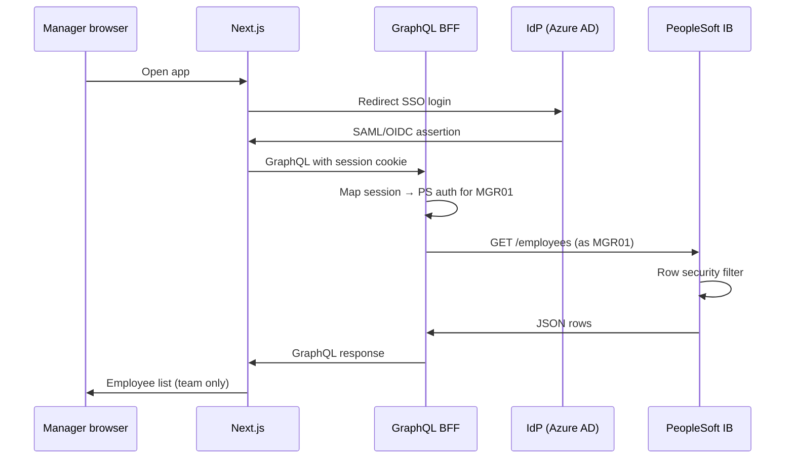

# Manager SSO → GraphQL → Integration Broker (row security)

**Course:** [COURSE.md § Module 11](./COURSE.md#module-11--real-peoplesoft--row-security) · **Compare dev (no RLS):** [`npm run dev:mock-ps`](../package.json) · **Scripts index:** [SCRIPT_COURSE_LINKS](./SCRIPT_COURSE_LINKS.md#by-supplemental-doc-doc--script)

Concrete target architecture for production: end users see only the rows PeopleSoft allows for **their** operator ID.

## End-to-end flow

```text
┌─────────────┐     SSO / session      ┌──────────────────┐
│   Browser   │ ─────────────────────► │  Next.js :3000   │
│  (Manager)  │                        │  /api/graphql    │
└─────────────┘                        └────────┬─────────┘
                                              │ GraphQL + user JWT/session
                                              ▼
                                     ┌──────────────────┐
                                     │ Apollo BFF :4000 │
                                     │ EmployeeService  │
                                     │ + auth middleware (target)│
                                     └────────┬─────────┘
                                              │ REST + PS user context
                                              ▼
                                     ┌──────────────────┐
                                     │ Integration      │
                                     │ Gateway / IB REST│
                                     └────────┬─────────┘
                                              │ Service operation
                                              ▼
                                     ┌──────────────────┐
                                     │ PeopleCode / CI  │
                                     │ or secure Query  │
                                     │ runs as Operator │
                                     └────────┬─────────┘
                                              │ Row-level security
                                              ▼
                                     ┌──────────────────┐
                                     │ PS tables        │
                                     │ PS_JOB, NAMES…   │
                                     └──────────────────┘
```

## Golden rule

**Never use a shared “HR Admin” PS user for the manager UI.**

| Caller | Row security |
|--------|----------------|
| Manager’s PS session / token | Only their team / scope |
| Batch integration service ID | Broad HR role — **backend-only**, not browser |

---

## PeopleSoft objects to configure

### 1. Security (before REST)

| Object | Purpose |
|--------|---------|
| **User profile** | Manager login (`MGR01`) |
| **Roles** | e.g. `MANAGER_SELF_SERVICE` |
| **Permission lists** | Pages, components, queries allowed |
| **Row-level security** | Dept tree, location, HR rep client list, etc. |
| **Query security** | If using Query Manager for list |

Validate in the UI first: log in as `MGR01` → employee list / team view shows **only** allowed rows.

### 2. Integration Broker service

| Step | PeopleTools | Result |
|------|-------------|--------|
| Define message | Integration Broker → Messages | `EMPLOYEE_SYNC` (example) |
| Define service | Services | `EMPLOYEE_GRAPHQL` |
| Operations | Service operations | `GET_EMPLOYEES`, `GET_EMPLOYEE`, optional `UPDATE_JOB` |
| Handler | PeopleCode or CI | Calls secure data access |
| REST resource | REST API / resource definition | Maps `GET /employees` → operation |
| Activate | Service version, routing | Live on Integration Gateway |

### 3. Handler pattern (row security preserved)

**Option A — Component Interface (preferred for updates)**

```text
GET_EMPLOYEES
  → PeopleCode
  → %OperatorId = authenticated user (from REST signon)
  → CI_JOB (or custom CI) Find() with standard keys
  → PeopleSoft applies row security on CI
  → Build JSON array → return
```

**Option B — Secure Query**

```text
GET_EMPLOYEES
  → Run Query EMPLOYEE_LIST_MGR (Query Manager)
  → Query run as %OperatorId
  → Query security + row security applied
  → Export rows to JSON
```

**Option C — Delivered REST (if licensed)**

Use Oracle-delivered HR REST where documented to honor user context; verify row security in PT docs for your version.

### 4. REST authentication

| Method | Notes |
|--------|------|
| **Basic + user/password** | Simple; pass manager credentials from BFF (avoid in browser) |
| **OAuth / token** | BFF exchanges SSO token for PS token |
| **Certificate** | Machine-to-machine integrations |

Browser → BFF only. BFF → PS with **per-request** user context (or short-lived token tied to user).

---

## GraphQL BFF changes (this repo)

### Today vs target

| Piece | Today | Target |
|-------|-------|--------|
| `PEOPLESOFT_DATA_SOURCE` | `mock` / `integration-broker` | `integration-broker` for prod |
| Auth | None | JWT/session middleware on Apollo |
| `integrationBrokerClient.ts` | Single env user/password | Per-request credentials from context |
| `employeeService.ts` | IB = same as env user | IB = `context.psUser` |
| CRUD mutations | CSV store (mock) | IB POST/PUT or CI via IB |
| Row security | N/A in mock | Enforced by PS; BFF does not widen scope |

### Context shape (target)

```typescript
type GraphQLContext = {
  employeeService: EmployeeService;
  psAuth: {
    operatorId: string;
    // token or basic derived from SSO session
  } | null;
};
```

### Middleware (sketch)

```text
1. Read Authorization header / session cookie
2. Validate JWT (IdP or your session store)
3. Map to PS credentials or PS token for this user
4. Reject if missing (no anonymous employee list)
5. Pass psAuth into IntegrationBrokerClient per request
```

### Client call (sketch)

```typescript
// integrationBrokerClient.ts — per request
async fetchEmployees(asOfDate, limit, offset, auth: PsAuth) {
  const response = await fetch(url, {
    headers: {
      Authorization: buildAuthHeader(auth), // user-scoped
      Accept: "application/json",
    },
  });
}
```

---

## Example: GET employees (manager)

### HTTP (BFF → PS)

```http
GET /psc/ps/HR92/EMPLOYEE/s/WEBLIB_REST/employees?asOfDate=2026-05-18&limit=50&offset=0
Authorization: Basic <manager-token-or-derived>
Accept: application/json
```

### PeopleSoft handler (conceptual)

```peoplecode
/* GET_EMPLOYEES — runs as REST-authenticated user */
&emplids = CreateArrayAny();

/* CI or Query restricted by standard PS security */
&sql = "SELECT EMPLID FROM PS_JOB WHERE ..."; /* or CI Find */
/* Row security applied via %OperatorId */

For each row
  &json = JsonString(&row);
End-For;

Return &response;
```

### JSON (PS → BFF)

```json
{
  "status": "success",
  "total": 12,
  "rows": [
    {
      "EMPLID": "100045",
      "NAME": "Maria Garcia",
      "DEPTID": "ENG",
      "MANAGER_ID": "100003"
    }
  ]
}
```

Manager with 12 direct/indirect reports → `total: 12`. HR admin service account might return 10000 — **do not use that for UI**.

---

## CRUD with row security

| UI action | PS pattern | Security |
|-----------|------------|----------|
| List | GET + Query/CI | Row filter |
| View one | GET by EMPLID | 404 if not authorized |
| Update | CI UPDATE or POST | CI rejects if row not editable |
| Add | CI CREATE | Role must allow hire/add |
| “Delete” | **PUT** terminate: `EFFDT` + `HR_STATUS` = `I` (or CI equivalent) | Not hard delete — history kept; BFF maps GraphQL `deleteEmployee` to this |

GraphQL mutations should map to **IB operations**, not CSV, in production:

```graphql
mutation UpdateEmployee($emplid: ID!, $input: EmployeeInput!) {
  updateEmployee(emplid: $emplid, input: $input)
}
```

Resolver → IB `PUT /employee/{id}` → CI UPDATE → PS validates operator may edit that row.

---

## SSO sequence (typical)



---

## Checklist before go-live

- [ ] Manager test user sees limited rows in **PS UI**
- [ ] Same user via **REST** returns same row count (curl as that user)
- [ ] GraphQL returns same count as REST for that user
- [ ] Different manager → different list (row security proof)
- [ ] No shared HR Admin credentials in frontend or public env
- [ ] HTTPS everywhere; secrets in vault
- [ ] Audit log: operatorId, operation, emplid, timestamp
- [ ] Effective dating tested (`asOfDate` query param end-to-end)

---

## Files in this repo to touch

| File | Change |
|------|--------|
| `integrationBrokerClient.ts` | Per-user auth header |
| `graphql/context.ts` | Build context from session |
| `employeeService.ts` | Pass auth into IB client; disable CSV CRUD in prod |
| `resolvers/index.ts` | Require authenticated context |
| `middleware` (new) | JWT/session validation |
| `.env` | No production passwords; use token exchange |

---

## Mock vs production

| Environment | Command | Data | Row security |
|-------------|---------|------|----------------|
| Dev `mock` + CSV | [`npm run dev`](../package.json) | [`employees.csv`](../backend/data/employees.csv) | Simulated (you edit CSV) |
| Dev mock IB | [`npm run dev:mock-ps`](../package.json) → [`mock-ib-server.ts`](../backend/src/mock-ib-server.ts) | Mock :4100 | None (demo only) |
| Prod | Real `PS_BASE_URL` in `.env` | Real IB | **PeopleSoft operator + roles** |

---

## Related docs

- [TEAM_BOUNDARIES.md](./TEAM_BOUNDARIES.md) — who owns BFF vs IB
- [DOCKER_AND_IB_CONFIGURE.md](./DOCKER_AND_IB_CONFIGURE.md) — cutover to real PS
- [CODE_PATH_GRAPHQL_TO_PS.md](CODE_PATH_GRAPHQL_TO_PS.md) — `integrationBrokerClient.ts` trace
- [GOOGLE_SHEETS.md](./GOOGLE_SHEETS.md) — mock data editing (dev only)
- [SCRIPT_COURSE_LINKS.md](./SCRIPT_COURSE_LINKS.md) — all lab commands
- [README.md](../README.md) — starter quick start
