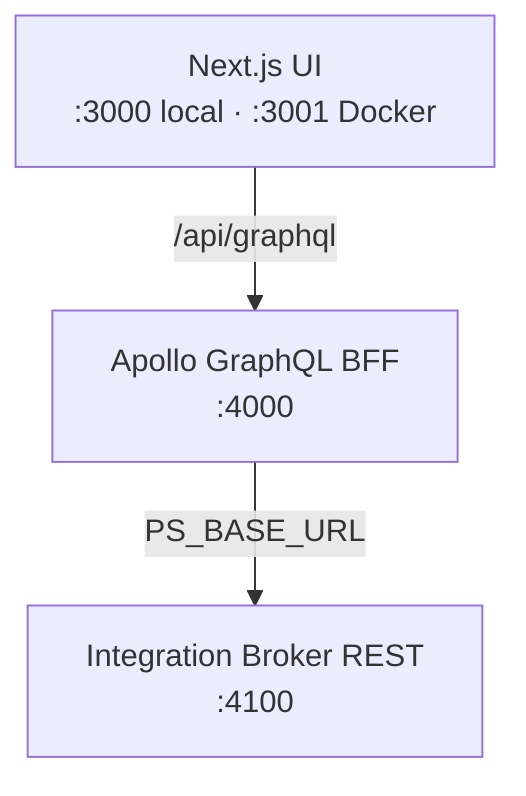
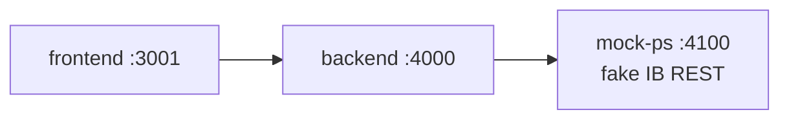
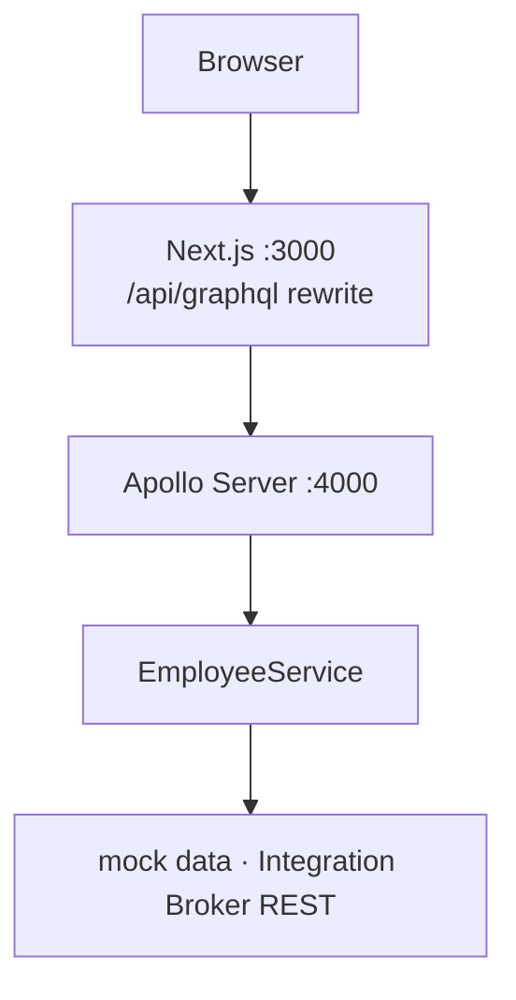
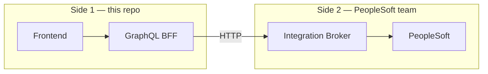
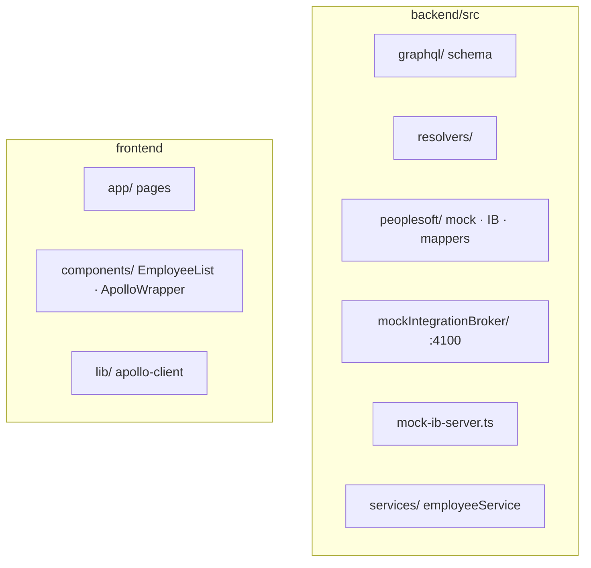

# PeopleSoft GraphQL Starter

Next.js UI → Apollo GraphQL (port **4000**) → **mock** PeopleSoft data → swap to **Integration Broker REST**.

<p align="center">
  
</p>



**Course hub:** [Courses/README.md](./Courses/README.md) (module map + commands)  
**Course intro:** [Courses/INTRODUCTION.md](./Courses/INTRODUCTION.md) (PeopleSoft + GraphQL in ~15 min)  
**Full-stack course:** [Courses/COURSE.md](./Courses/COURSE.md) (Modules 0–12)  
**Scripts ↔ course (two-way):** [Courses/SCRIPT_COURSE_LINKS.md](./Courses/SCRIPT_COURSE_LINKS.md)  
**App vs PeopleSoft team:** [Courses/TEAM_BOUNDARIES.md](./Courses/TEAM_BOUNDARIES.md)  
**Advanced section (optional):** [Agents → MCP Server → MCP Apps Client](./Courses/MODULE_13_APOLLO_MCP_AGENTS.md) — what changes at each layer vs the core course

## Versioning

Current version: **0.0.1** (see `package.json`).

After `npm install`, a **pre-commit hook** bumps the **patch** version on every commit (`0.0.1` → `0.0.2` → …) in root, `backend/`, and `frontend/` `package.json` files.

Skip once: `SKIP_VERSION_BUMP=1 git commit -m "your message"`

Manual bump: `npm run version:patch`

## Port conflicts? (Docker vs `npm run dev`)

**Do not run both at once** — they fight for the same ports.

| Mode | Command | UI | GraphQL | Mock PS |
|------|---------|-----|---------|---------|
| **Docker** | `npm run stack:docker` | http://localhost:3001 | :4000 | :4100 |
| **Local** | `npm run dev:mock-ps` | http://localhost:3000 | :4000 | :4100 |

If you see `EADDRINUSE` or `address already in use`:

```bash
npm run stack:stop   # → scripts/stop-dev-stack.sh (Course: Module 2 / 7b)
# then start ONE mode only
```

Paste errors like `^[[200~cd` happen when bracketed paste is on — type commands manually or run `npm run stack:stop` without the `#` comment lines.

---

## Docker (mock PeopleSoft — no real PS site)

Runs the full stack with a **mock Integration Broker** pretending to be PeopleSoft on your network:



```bash
docker compose up --build
```

| URL | Service |
|-----|---------|
| http://localhost:3001 | Next.js UI (3001 avoids clash with local `npm run dev` on 3000) |
| http://localhost:4000 | GraphQL |
| http://localhost:4100/employees | Mock PS REST (Basic `demo` / `demo`) |

For your **real** site later, see `docker-compose.real-ps.example.yml` (set `PS_BASE_URL` to Integration Broker — not direct Oracle DB).

> **IMPORTANT:** [`docker-compose.yml`](docker-compose.yml) is **dev only** (includes mock `mock-ps`). **Production** configuration: [Courses/DOCKER_AND_IB_CONFIGURE.md § Production](Courses/DOCKER_AND_IB_CONFIGURE.md#how-to-configure-the-production-environment).

**Course module:** [Courses/DOCKER_AND_IB_CONFIGURE.md](Courses/DOCKER_AND_IB_CONFIGURE.md) · IB comment map in `docker-compose.yml`

## Quick start

```bash
cd ~/Documents/Projects/peoplesoft-graphql-starter
npm install
npm install --prefix backend
npm install --prefix frontend
npm run dev
```

- Frontend: <http://localhost:3000>
- GraphQL: <http://localhost:4000> (proxied via Next.js at `/api/graphql`)

## Architecture

See [Courses/INTRODUCTION.md](./Courses/INTRODUCTION.md) for the full narrative.



### Two sides (and why it matters at work)

In many organizations **your app team** owns Side 1; a **PeopleSoft team** owns Side 2.

| Side | What | Contract |
|------|------|----------|
| **1 — App** | Next.js UI + GraphQL BFF (ports 3000 / 4000) | GraphQL (`employees`, mutations) — **your** frontend only talks here |
| **2 — PeopleSoft** | Integration Broker REST (or local stand-in) | HTTP + JSON (`EMPLID`, `EMAIL_ADDR`, …) — **between teams**, not GraphQL |



- **`PEOPLESOFT_DATA_SOURCE=mock`** — Side 2 is local CSV/memory (no PS team, no HTTP).
- **`PEOPLESOFT_DATA_SOURCE=integration-broker`** — Side 2 is `integrationBrokerClient.ts` → `PS_BASE_URL` (real PS, mock IB on :4100, or [Google Sheet via Apps Script](./Courses/GOOGLE_SHEET_AS_MOCK_PS.md)).

**Study the PS boundary in:** `backend/src/peoplesoft/integrationBrokerClient.ts` (JSDoc explains terminate-on-delete)  
**Full write-up:** [Courses/TEAM_BOUNDARIES.md](./Courses/TEAM_BOUNDARIES.md) · [Courses/CODE_PATH_GRAPHQL_TO_PS.md](./Courses/CODE_PATH_GRAPHQL_TO_PS.md) · [§ PS terminate vs delete](./Courses/CODE_PATH_GRAPHQL_TO_PS.md#ps-terminate-vs-delete)

**PeopleSoft JSON mapping:** Inbound IB responses are mapped in `mappers.ts` (`EMPLID` → `emplid`, etc.). GraphQL types align 1:1 with `EmployeeRecord` (no separate GraphQL mapper). Outbound POST/PUT still send camelCase bodies until a reverse mapper is wired — see [Courses/CODE_PATH § Two-way mapping](./Courses/CODE_PATH_GRAPHQL_TO_PS.md#two-way-mapping).

## Edit employees in Google Sheets

1. `npm run export:employees` → creates `backend/data/employees.csv`
2. Import that CSV into [Google Sheets](https://sheets.google.com)
3. Add / edit rows in the sheet (see [Courses/GOOGLE_SHEETS.md](./Courses/GOOGLE_SHEETS.md) for headers including `hr_status`; UI **Delete** terminates via a new `hr_status=I` row, not row removal)
4. Download CSV back **or** `npm run sync:sheet` with a published Sheet URL
5. Restart the backend — data loads into GraphQL objects automatically

## Mock PeopleSoft side (Integration Broker REST)

Simulates what real PS Integration Broker returns (JSON with `EMPLID`, `NAME`, `EMAIL_ADDR`, etc.) on port **4100**.

```bash
cp backend/.env.mock-ib.example backend/.env
npm run dev:mock-ps
```

This starts:

- **mock-ps** — fake IB REST at <http://localhost:4100>
- **backend** — GraphQL calls IB via `PS_BASE_URL` (`integration-broker` mode)
- **frontend** — <http://localhost:3000>

Try the mock IB directly:

```bash
curl -u demo:demo "http://localhost:4100/employees"
curl -u demo:demo "http://localhost:4100/employee/100001?asOfDate=2024-06-01"
```

Code: `backend/src/peoplesoft/mockIntegrationBroker/`

### Logs & call-path trace (`dev:mock-ps`)

`npm run dev:mock-ps` tees stdout to `logs/mock-ib.log`, `logs/backend.log`, and `logs/frontend.log`.

```bash
npm run logs          # last lines from all three
npm run logs:follow   # tail -f all three
```

**Trace the GraphQL → PS path:** dev logs lines tagged `[trace]` (graphql → resolver → service → IB → mock-ps). Example:

```bash
grep '[trace]' logs/backend.log
```

On by default in dev; set `DEV_TRACE=0` in `backend/.env` to disable. More: [Courses/CODE_PATH_GRAPHQL_TO_PS.md](./Courses/CODE_PATH_GRAPHQL_TO_PS.md) (Mode B / `[trace]`).

**Restart:** if ports are busy, run `npm run stack:stop` first (see [Port conflicts](#port-conflicts-docker-vs-npm-run-dev) above).

## Swap mock → real Integration Broker

1. Copy `backend/.env.example` values into `backend/.env`
2. Set:

   ```env
   PEOPLESOFT_DATA_SOURCE=integration-broker
   PS_BASE_URL=https://your-host/.../your-rest-base
   PS_USERNAME=...
   PS_PASSWORD=...
   ```

3. Edit `backend/src/peoplesoft/integrationBrokerClient.ts` — set the real REST paths for your delivered IB service
4. Adjust `backend/src/peoplesoft/mappers.ts` for your JSON field names

## GraphQL queries

```graphql
query {
  employees {
    emplid
    name
    email
    department
    manager { name }
  }
}

query {
  employee(id: "100001", asOfDate: "2026-05-18") {
    emplid
    name
    effectiveDate
  }
}
```

## Project layout



# Google Sheets as the employee source
https://docs.google.com/spreadsheets/d/e/2PACX-1vQyNmWHCtWVtuiko06XwiKhZaa-2s0OJsixiiJKn9zRB0Fh420g6jkYaCUoY-c9EQSgQIUoLXXWQq6D/pub?gid=164390836&single=true&output=csv