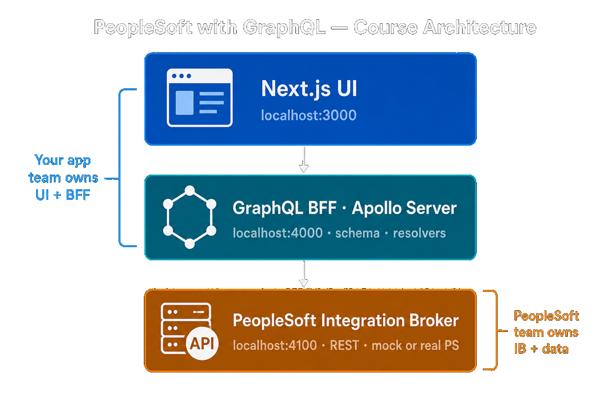
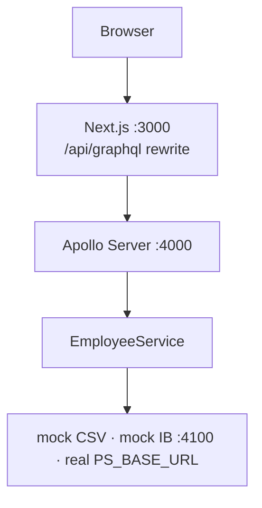
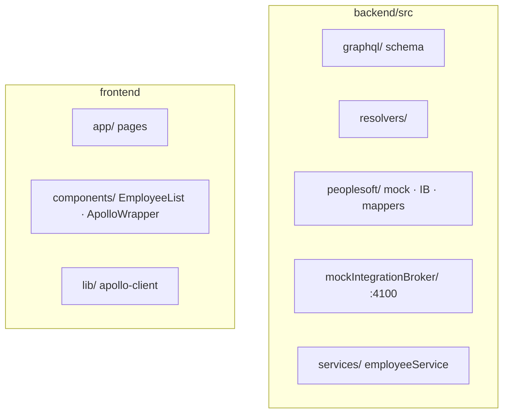

# Using GraphQL to get PeopleSoft data

Hands-on course and runnable starter: connect a **modern Next.js UI** to **PeopleSoft-style HR data** through a **GraphQL Backend-for-Frontend (BFF)**, without installing Oracle PeopleSoft on your laptop.

<p align="center">
  
</p>

| Layer | Port (local) | Who owns it (typical org) |
|-------|----------------|---------------------------|
| **Next.js UI** | 3000 (3001 Docker) | Your app / frontend team |
| **GraphQL BFF · Apollo Server** | 4000 | Your app team — schema, resolvers, `EmployeeService` |
| **Integration Broker REST** | 4100 mock · real `PS_BASE_URL` | PeopleSoft team — IB services + data rules |

---

## What this course is about

**Problem:** PeopleSoft exposes **REST through the Integration Broker (IB)** — field names like `EMPLID`, effective dating, terminate-not-delete. Product UIs want **one stable API** shaped for screens.

**Approach:** Your team builds a **GraphQL BFF** in this repo. The browser talks **only** to GraphQL (`/api/graphql`). The BFF translates to IB HTTP, maps PS JSON ↔ GraphQL types, and hides PS complexity (pagination, as-of dates, row security concepts).

**What you will do:**

1. Run the stack locally with **mock data** (CSV / in-memory) — no PS license required.
2. Swap to a **mock Integration Broker** on `:4100` and trace every `fetch()` on the GraphQL → PS path.
3. Run the same pattern in **Docker**, then study **real IB**, row security, and production config.
4. Optionally explore **Apollo MCP** (Section 13) for agent tools over the same GraphQL API.

**You will not:** install PeopleTools, wire Oracle JDBC, or learn PeopleCode in Module 0. You **will** learn the **integration boundary** your app team owns vs what the PeopleSoft team owns.

**Audience:** Developers comfortable with JavaScript/TypeScript. First lab ~30 minutes after [Courses/INTRODUCTION.md](./Courses/INTRODUCTION.md) (~15 min read).

---

## Start here

| Step | Doc | Time |
|------|-----|------|
| 1 | **[Courses/INTRODUCTION.md](./Courses/INTRODUCTION.md)** — PeopleSoft, GraphQL, team boundaries | ~15 min |
| 2 | **[Courses/COURSE.md](./Courses/COURSE.md)** — Modules **0 → 12** (labs + checkpoints) | Main path |
| 3 | **[Courses/SCRIPT_COURSE_LINKS.md](./Courses/SCRIPT_COURSE_LINKS.md)** — every `npm run` ↔ file ↔ module | As needed |

**Supplemental (linked from modules):**

| Doc | Topic |
|-----|--------|
| [TEAM_BOUNDARIES.md](./Courses/TEAM_BOUNDARIES.md) | App team vs PeopleSoft team |
| [CODE_PATH_GRAPHQL_TO_PS.md](./Courses/CODE_PATH_GRAPHQL_TO_PS.md) | Trace Save → `fetch()`; `[trace]` logs; two-way mapping |
| [DOCKER_AND_IB_CONFIGURE.md](./Courses/DOCKER_AND_IB_CONFIGURE.md) | Docker stack; dev vs production IB |
| [GOOGLE_SHEETS.md](./Courses/GOOGLE_SHEETS.md) | Edit mock CSV via Sheets |
| [GOOGLE_SHEET_AS_MOCK_PS.md](./Courses/GOOGLE_SHEET_AS_MOCK_PS.md) | Apps Script as mock IB |
| [PEOPLESOFT_IB_ROW_SECURITY.md](./Courses/PEOPLESOFT_IB_ROW_SECURITY.md) | Manager SSO → row security |
| [MODULE_13_APOLLO_MCP_AGENTS.md](./Courses/MODULE_13_APOLLO_MCP_AGENTS.md) | **Optional** — Agents → MCP Server → MCP Apps Client |

**Terminology:** **Modules** 0–12 = core path. **Section 13** = optional advanced topic.

---

## Module map

| Module | Topic | Primary `npm run` |
|--------|--------|-------------------|
| 0 | Setup & first run | `dev` |
| 1 | Architecture & team boundaries | (read) → [TEAM_BOUNDARIES](./Courses/TEAM_BOUNDARIES.md) |
| 2 | Three runtimes (ports) | `dev`, `stack:stop` |
| 3 | GraphQL contract | `dev:backend` |
| 4 | Backend boot | `dev:backend`, `typecheck` |
| 5 | Resolvers & service | `dev:backend` |
| 6 | Mock data & CSV | `export:employees`, `sync:sheet` |
| 7 | Mock Integration Broker | `dev:mock-ps`, `mock-ib` |
| 7b | Docker mock stack | `stack:docker`, `stack:stop` |
| 8 | Frontend (Next.js + Apollo) | `dev:frontend`, `dev` |
| 9 | CRUD (`delete` = terminate) | `dev` or `dev:mock-ps` |
| 10 | Pagination & effective dating | `dev` |
| 11 | Real PS & row security | (config) |
| 12 | Capstone | `build`, `stack:docker` |
| **§13** | Apollo MCP (optional) | `dev:with-mcp`, `dev:mcp` |

All commands: **[SCRIPT_COURSE_LINKS.md](./Courses/SCRIPT_COURSE_LINKS.md)**.

---

## Quick start

```bash
cd ~/Documents/Projects/peoplesoft-graphql-starter
npm install
npm install --prefix backend
npm install --prefix frontend
npm run dev
```

| URL | Service |
|-----|---------|
| http://localhost:3000 | Next.js UI |
| http://localhost:4000 | GraphQL (also via UI `/api/graphql`) |

**Recommended mock-PS path (Module 7):** `npm run dev:mock-ps` — mock IB `:4100` + GraphQL + UI + trace logs under `logs/`.

---

## Port conflicts? (Docker vs local)

**Do not run Docker and `npm run dev` together** — same ports.

| Mode | Command | UI | GraphQL | Mock PS |
|------|---------|-----|---------|---------|
| **Local** | `npm run dev:mock-ps` | :3000 | :4000 | :4100 |
| **Docker** | `npm run stack:docker` | :3001 | :4000 | :4100 |

```bash
npm run stack:stop   # free ports, then start ONE mode
```

---

## Architecture (detail)



**Data modes (`PEOPLESOFT_DATA_SOURCE`):**

| Value | Side 2 behavior |
|-------|------------------|
| `mock` | Local CSV / memory — Module 6 |
| `integration-broker` | HTTP to `PS_BASE_URL` — mock `:4100`, real IB, or [Google Sheet Apps Script](./Courses/GOOGLE_SHEET_AS_MOCK_PS.md) |

**Key files:** `backend/src/peoplesoft/integrationBrokerClient.ts` (IB boundary) · `mappers.ts` (`EMPLID` → `emplid`) · [CODE_PATH](./Courses/CODE_PATH_GRAPHQL_TO_PS.md) · [TEAM_BOUNDARIES](./Courses/TEAM_BOUNDARIES.md)

---

## Docker (mock PeopleSoft)

```bash
docker compose up --build
```

| URL | Service |
|-----|---------|
| http://localhost:3001 | Next.js UI |
| http://localhost:4000 | GraphQL |
| http://localhost:4100/employees | Mock IB REST (`demo` / `demo`) |

Production IB: see `docker-compose.real-ps.example.yml` and [DOCKER_AND_IB_CONFIGURE.md § Production](./Courses/DOCKER_AND_IB_CONFIGURE.md#how-to-configure-the-production-environment).

> [`docker-compose.yml`](docker-compose.yml) is **dev only** (includes `mock-ps`).

---

## Mock IB & dev traces

```bash
cp backend/.env.mock-ib.example backend/.env
npm run dev:mock-ps
```

```bash
curl -u demo:demo "http://localhost:4100/employees"
grep '[trace]' logs/backend.log   # graphql → resolver → service → IB → mock-ps
npm run logs                      # tail mock-ib, backend, frontend logs
```

Set `DEV_TRACE=0` in `backend/.env` to disable traces. Code: `backend/src/peoplesoft/mockIntegrationBroker/`.

---

## Google Sheets (mock data)

1. `npm run export:employees` → `backend/data/employees.csv`
2. Import into Google Sheets — [GOOGLE_SHEETS.md](./Courses/GOOGLE_SHEETS.md)
3. `npm run sync:sheet` or download CSV → restart backend

---

## Swap mock → real Integration Broker

```env
PEOPLESOFT_DATA_SOURCE=integration-broker
PS_BASE_URL=https://your-host/.../your-rest-base
PS_USERNAME=...
PS_PASSWORD=...
```

Adjust paths in `integrationBrokerClient.ts` and field names in `mappers.ts`.

---

## GraphQL examples

```graphql
query {
  employees {
    emplid
    name
    email
    department
    manager { name }
  }
}

query {
  employee(id: "100001", asOfDate: "2026-05-18") {
    emplid
    name
    effectiveDate
  }
}
```

---

## Project layout



| Path | Role |
|------|------|
| `Courses/` | All course markdown + `images/` + Apps Script |
| `backend/data/employees.csv` | Mock dataset |
| `scripts/stop-dev-stack.sh` | `stack:stop` |

---

## Versioning

Current version: **0.0.8** (see `package.json`). Pre-commit hook bumps patch on each commit. Skip once: `SKIP_VERSION_BUMP=1 git commit`. Manual: `npm run version:patch`.
